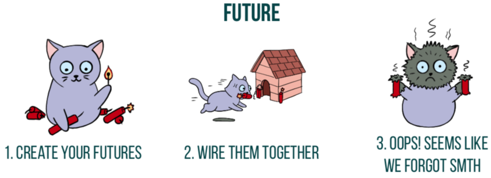

# 第1章. 効果：評価と実行

私たちは、コードの動作について話すときに、「その操作の効果は何ですか」とか、デバッグのときに「それをやっても効果がないはずですが、どうなっているのですか」というように、効果という言葉をよく使いますが、ここで「どうなっているのですか」はほとんどの場合、罵倒語に置き換えられています。しかし、効果とは何でしょうか？私たちがより理解しやすい、より良いプログラムを書くために、効果について正確な方法で話すことはできるのでしょうか？
効果とは何か、そしてそれをどのように利用できるかを探るために、コードの2つの側面、すなわち値の計算と環境との相互作用を区別して考えます。同時に、これらの側面を記述する際に、コードがどれだけ透明であるか、あるいは透明でないか、そしてプログラマーとして何ができるかを説明します。

## 1.1. 評価の代替モデル

まず、最初の側面である値の計算から見ていこう。プログラマーとして私たちはあるコード、例えばメソッドを書き、そのメソッドが値を計算し、そのメソッドの呼び出し元に返されます。

```scala
def plusOne(i: Int): Int = i+1
val x = plusOne(plusOne(12))
```

このコードについて、いくつか紹介します。

1. plusOneはInt型の引数をとり、Int型の値を生成するメソッドです。plusOneはInt ⇒ Intという型シグネチャを持ち、「IntからIntへ」「plusOneはIntからIntへの関数」と発音される
2. xは値である。plusOne(plusOne(12)) という式を評価した結果として定義されます。

このコードを評価するために代入を使ってみよう。plusOne(plusOne(12)) という式から始めて，それぞれの（部分）式をその定義で代入し，部分式がなくなるまで再帰的に繰り返す．

1. 内側のplusOne(12)をその定義に置き換えてください。

```scala
- val x = plusOne(plusOne(12))
+ val x = plusOne(12 + 1)
```

2. 12 + 1 を 13 に置き換える

```scala
- val x = plusOne(12 + 1))
+ val x = plusOne(13)
```

3. plusOne(13) をその定義に置き換えてください

```scala
- val x = plusOne(13)
+ val x = 13 + 1
```

4. 13 + 1 を 14 に置き換える

```scala
- val x = 13 + 1
+ val x = 14
```

この例では、いくつかの特殊な性質に注目することが重要である。

1. plusOneが何をするのか理解するために、plusOneの（文字通りの）定義以外の場所を見る必要はありません。その外には何も参照するものがないのです。これは局所推論と呼ばれることもあります。
2. 代入では，プログラムが同じ値に評価されれば，同じことを意味します．13 + 1 は 14 と全く同じ意味です。plusOne(12 + 1)もそうだし、(12 + 1) + 1もそうである。これは参照透過と呼ばれる。

関数型プログラミングの入門コースで教えていたときの私の言葉を引用すると、「[代入]はとても愚かなことで、コンピュータでもできる！」です。すべてのプログラムがplusOneのように自己完結していて、私たち人間が代入を使ってコードを評価し、コンピュータと同じ値を出すことができたら、それは素晴らしいことだと思います。

しかし、代入は実際の評価がどのように行われるかのモデルに過ぎない。あらゆる種類の式を扱えるわけではありません。代入が破綻するのはどのような場合でしょうか？いくつかの例を思いつくことができますか？

思い当たるものをいくつかご紹介します。

1. コンソールに印刷する場合 println関数は、コンソールに文字列を印字する関数で、戻り値はUnit型です。代入をかけると

```scala
- val x = println("Hello world!")
+ val x = ()
```

最初の表現と2番目の表現の意味-効果-は非常に異なっている。後者では何も印刷されません。代入を使っても、私たちの意図した通りにはならないのです。

2. 外界から値を読み取る場合。代入を適用すると

```scala
- val name = readLine
+ val name = <whatever you typed in the console>
```

これはコンソールから読み込まれた特定の文字列として評価されますが、その特定の文字列は式 readLine の評価と同じではありません。readLine式は他のものに評価される可能性があります。

3. 式がミュータブル変数を参照する場合

ミュータブルな変数を扱う場合、式の値はその変数に対するあらゆる可能な変更に依存します。次の例では、もし何らかのコードがiの値を変更したら、それはxの評価も変更することになります。

```scala
var i = 12


- val x = { i += 1; i }
+ val x = 13
```

この例は、前の例と非常によく似ています。コンソールにタイプすることは、readLineが返す内容を持つミュータブル変数に書き込むことと考えることができます。

## 1.2. 副作用への対応

効果の第二の側面は、値の計算の後に、環境との相互作用があることです。そして、これまで見てきたように、これによって置換が壊れることがある。環境は変化する可能性があり、非決定的であるため、環境を含む式は必ずしも同じ値で評価されるとは限りません。ミュータブルな状態を使用する場合、隠れた副作用を実行する場合、つまり代入を中断する場合、すべてが失われるのでしょうか？そうではない。

コードに関する推論能力を維持する方法の1つは、置換を破る「不純な」コードをローカライズすることである。外から見ると、コードは置換が行われているように見え、評価されます。しかし、境界の内側には、ドラゴンがいる。

```scala
 def sum(ints: List[Int]): Int = { var sum = 0 // 1
ints.foreach(i => sum += i) sum
}
sum(List(1, 2, 3)) // 2
```

1. ミュータブル変数を使用してしまった。恐るべし! しかし、sumの外部からは何も影響を受けることはありません。その存在は1回の呼び出しに限定されます。
2. sumを使った式を評価すると、決定論的な答えが得られます。このレベルでは代入が効く。

リストの合計を計算するコードを最適化したため、リストに対して不変のフォールドを使用する代わりに、ローカル変数を更新しています。呼び出し側から見ると、代入は維持されている。不純なコードでは、代入がもたらす推論を利用できないので、コードの振る舞いを自分自身で証明するには、この本の範囲外である他のテクニックを使用する必要があります。

ローカライゼーションは良いトリックですが、代入を破るもの全てに有効なわけではありません。私たちはプログラムの中で実際に何かをするために副作用を必要としますが、副作用は安全ではありません! でも副作用は安全ではありません！どうしたらいいのでしょうか？

## 1.3. Effectパターン

いくつかの条件を課すことで、副作用をより安全なものに手なずけることができます。これをエフェクトと呼ぶことにします。次の2つの部分があります。

1. プログラムの型は、それが生成する値の型に加えて、そのプログラムがどのような効果を発揮するのかを教えてくれるはずです。不純なコードの問題点は、それが不純であることが分からないことです! 外から見ると、メソッドやコードのブロックのように見えます。効果に型を与えることで、他のコードと区別することができます。同時に、計算結果の型を追跡し続けることができます。
2. 欲しい動作が外から見える副作用に依存している場合、欲しい効果を記述することと、実際にそれを実現することを分けて考える。実行するまでの記述については、自由に置き換えることができる。この考え方はローカライズの考え方と全く同じですが、コードの最内層で副作用を実行し外層から隠す代わりに、副作用を遅延させて評価の外側で実行し、内部で置換が成立するようにする点が異なります。このような条件を「効果パターン」と呼び、私たちが日常的に使っている効果や、新しい種類の効果の研究・記述に応用していきます。

#### Effect Pattern Checklist
1. プログラムのタイプは私たちに教えてくれますか？
   1. プログラムがどのような効果をもたらすか
   2. プログラムがどのような価値を生み出すか
2. 外部に見える副作用が必要な場合、効果の記述は実行と分離されているか？

どのような効果が考えられますか？それらは両方のルールを満たしていますか？なぜそう思うのですか？

ここでは、よく使われる2つのタイプ、OptionとFutureをEffect Patternの基準で分析してみましょう。これらは効果か？副作用はあるか、そして安全に管理されているか？

### 1.3.1. 例 Optionは効果か？

Scalaを含む多くの言語では、値がないことを意味するnull値の使用を許可しています。プログラマー（あなた！）は、値がNULLかどうかをチェックする必要があります。そうしないと、恐ろしいNullPointerExceptionが実行時にスローされます。

```scala
def isValid(filename: String) =
  filename.length > 0 && filename.startsWith("/") // NullPointerExceptionが多発するので注意。
isValid(null)
```

どのような場合であるかを確認し忘れることを防ぐために、Scalaはオプション性をエンコードする別の方法として、代数的なデータ型を提供しています。

```scala
sealed trait Option[+A]
case class Some[A](value: A) extends Option[A]
case object None extends Option[Nothing]
```

Option[A]は効果あるのか？基準を確認しよう

Q1. Option[A]は、プログラムが生み出す価値の種類だけでなく、どのような効果をもたらすかを教えてくれるのでしょうか？
A1. はい：もしOption[A]という型の値があれば、Optionという名前からその効果がオプションであることがわかりますし、型パラメータAから型Aの値を生成する可能性があることもわかっています。

Q2. 外から見える副作用は必要ですか？
A2. そうではありません。Optionデータ型は、置換を維持するオプション性を表すインタフェースである。メソッドコールをその実装に置き換えても、プログラムの意味は変わらない。ただし、例外的に、外から見える副作用が発生する可能性があります。

```scala
def get(): A = 
  this match {
    case Some(a) => a
    case None => throw new NoSuchElementException("None.get")
  }
```

None で get を呼び出すとプログラマのエラーとなり、例外が発生し、その結果スタックトレースが表示されるかもしれません。しかし、この副作用は例外の概念の核心ではなく、デフォルトの例外ハンドラの実装に過ぎない。例外の本質は非局所的な制御フローであり、動的スコープにある例外ハンドラへのジャンプであり、外部からは見えない副作用である。

この2つの条件を満たせば、Option[A]は「はい、効果です！」と言うことができます。

Optionは副作用を実行しないので、エフェクトと呼ぶのは奇妙に思えるかもしれません。Effectパターンの最初の条件のポイントは、型が効果の存在を可視化することである。Optionの伝統的な代替案としては、null値を使うことが考えられるが、それでは型Aの値がnullかどうかどうやって判断するのだろうか？null 値を持ちうるいくつかの型は、値がないという概念を持つことを意図していない。Option はこの区別を明らかにする。

####  Effect Pattern Checklist: Option[A]の場合

1. プログラムの種類でわかるのか
  1. どのような効果をもたらすのか、そして

    ```Option型は任意性を表す。 オプション性とは、ある値が存在するかもしれない（しないかもしれない）ことを意味する。```
  2. どのような価値を生み出すのか？

    ```A タイプの値が存在する場合、その値。```
2. 外部から見える副作用が必要な場合、その効果の記述は実行と分離されているか？ 実行とは別のものか？

   ```外から見える副作用は必要ありません。```

したがって、Optionは効果である。

### 1.3.2. 例: Futureは効果か？

Futureには、簡単には見えない問題があることが知られています。例えば、次のコードを見てください。同じFutureを参照して、2回実行しています。

```scala
val print = Future(println("Hello World!"))
val twice = print.flatMap(_ => print)
```

どのような出力が出るのか？

```shell
Hello World!
```

印刷されるのは1回だけ! なぜでしょう？

その理由は、Futureは構築されるとすぐに実行されるようにスケジュールされているからです。そのため、他の「記述的」な操作（flatMapの後続の印刷）が後で起こったとしても、副作用は（ほとんど）すぐに起こります。つまり、printを2回実行することを記述していますが、副作用は1回しか実行されないのです!

この実装にprintの定義を代入するとどうなるか、比べてみてください。

1. Replace the first reference to print with its definition
```scala
val print = Future(println("Hello World!"))
val twice = Future(println("Hello World!")).flatMap(_ => print)
```

2. 2番目のprintへの参照をその定義に置き換え、printの定義を削除します。
```scala
val twice = Future(println("Hello World!"))
  .flatMap(_ => Future(println("Hello World!")))
```

それを実行することで、私たちは見ることができます。

```shell
Hello World!
Hello World!
```

これが、Future is not an effectと言う理由です。表現をその定義に置き換えることは、同じ意味を持ちません。

####  Effect Pattern Checklist: Future[A]の場合

1. プログラムの種類でわかるのか
1. どのような効果をもたらすのか、そして

   ```Futureは非同期の計算を表します。```
2. どのような価値を生み出すのか？

   ```非同期計算が成功した場合、タイプAの値を返す。```
2. 外部から見える副作用が必要な場合、その効果の記述は実行と分離されているか？ 実行とは別のものか？

   ```外から見える副作用が必要：Future本体は副作用も含めて何でもできる。しかし、それらの副作用は、構成された操作の記述の後に実行されるのではなく、構築時に直ちに実行がスケジューリングされる。```

したがって、Futureは効果記述と実行を分離しないので、安全ではありません。



## 1.4. 任意の副作用を効果として捕捉する

ここまで、副作用を伴わないOption効果型を見て、なぜFutureが効果でないのかを検証してきました。では、副作用を伴うが安全なエフェクトはどうでしょうか？

これがcats.effectのIO effect型の目的です。これは、Effectパターンに従って、安全な方法で、あらゆる副作用を捕捉することができるデータ型です。まず、IOの仕組みを理解するために、独自のバージョンを構築します。

最初のエフェクトを作りましょう。任意の副作用を捕らえたいのです。コンソールに文字列を表示し、その後にそれを実行するエフェクトを記述することで、それを実演します。

例1．MyIOエフェクトタイプで副作用を捕捉する。

```scala
package sample.effects

case class MyIO[A](unsafeRun: () => A) // 1

object MyIO:
  def putStr(s: => String): MyIO[Unit] =
    MyIO(() => println(s)) // 2

object Printing extends App
  val hello = MyIO.putStr("hello!") // 3
  hello.unsafeRun() // 4
```

1. 私たちが遅らせたい副作用は、関数 unsafeRun として捕捉されます。unsafeRunと名付けたのは、この関数が置換を維持しないことを皆に知らせたいからです。
2. 印刷効果のあるputStrは、println関数の実行を遅延させるMyIO値を構築することで定義しています。
3. 「こんにちは！」の印刷をMyIOの値として記述しています。しかし、まだ実行されていない。
4. ここでは、その効果を明示的に実行します。~~

印刷プログラムを実行すると、出力されます。

```shell
hello!
```

Printingプログラムでは、MyIOが再帰的に各式をその定義に置き換えることで、置換を維持していることを確認しましょう。

1. 私たちのオリジナルプログラムです。

```scala
object Printing extends App:
  val hello = MyIO.putStr("hello!")
  hello.unsafeRun()
```

2. 値 hello をその定義に置き換える MyIO.putStr("hello!")

```scala
MyIO.putStr("hello!").unsafeRun()
```

3. MyIO.putStr 式をその定義に置き換える MyIO(() => println("hello"))

```scala
MyIO(() => println("hello!")).unsafeRun()
```

4. unsafeRun() 式をその定義に置き換え、評価する。

```scala
println("hello!")
```

プログラムの式を再帰的にその定義に置き換えた後、Printing プログラムの本体は println("hello!") という式と等価になります。そう、MyIOは置換を維持する。すべての評価の後、プログラムの意味は維持される。

## 1.5. エフェクトの合成

個々のエフェクトを構築し、それを実行することはできますが、それらをどのように組み合わせればよいのでしょうか。エフェクトの出力を変更したり（map経由）、エフェクトの出力を使って新しいエフェクトを作成したり（flatMap経由）したいかもしれません。これらのメソッドをMyIOに追加してみましょう。

しかし、注意してください! エフェクトを合成しても、それを実行してはならない。置換を維持するために合成を必要とするので、他の効果から効果を構築することができます。

例2．MyIOにmapとflatMapのメソッドを追加する。

```scala
package sample.effects

case class MyIO[A](unsafeRun: () => A):
  def map[B](f: A => B): MyIO[B] = MyIO(() => f(unsafeRun())) // 1
  def flatMap[B](f: A => MyIO[B]): MyIO[B] = MyIO(() => f(unsafeRun()).unsafeRun()) // 2

object MyIO:
  def putStr(s: => String): MyIO[Unit] =
    MyIO(() => println(s))

object Printing extends App:
  val hello = MyIO.putStr("hello!")
  val world = MyIO.putStr("world!")
  val helloWorld: MyIO[Unit] = // 3
    for
      _ <- hello
      _ <- world
    yield ()
  helloWorld.unsafeRun()

```

1. mapの定義は簡単である。B型の値を返す新しいMyIOを作成する。A ⇒ B の関数 f があるのだから、A の値はどこで手に入るのか？unsafeRunを使う。
2. flatMapの定義は少し複雑です。unsafeRun の出力で f を呼び出すと、B ではなく MyIO[B] が得られますが、その MyIO に対して unsafeRun を呼び出すと、必要な B の値が得られます。この定義は、flatMapが行うべきこと、つまり、2つの操作を順番に行い、一方が他方より先に起こるようにすることと一致する。
3. helloとworldの効果をfor-comprehension（flatMapを使用）で結合し、その合成で1つの効果を返すようにしています。

Printingプログラムを実行すると、生成されます。

```shell
hello!
world!
```

### 1.5.1. エフェクトとしてのMyIO

MyIOをEffect Patternと照らし合わせてみましょう。

####  Effect Pattern Checklist: MyIO[A]の場合

1. プログラムの種類でわかるのか
1. どのような効果をもたらすのか、そして

   ```MyIOは、（おそらく）副作用のある計算を表します。```
2. どのような価値を生み出すのか？

   ```計算が成功した場合、A タイプの値。```
2. 外部から見える副作用が必要な場合、その効果の記述は実行と分離されているか？ 実行とは別のものか？

   ```外部から見える副作用が必要：実行されると、MyIOは副作用を含めて何でもできるようになる。MyIOの値を構築し、mapとflatMapで合成して記述する。効果の実行は unsafeRun が呼ばれたときのみ行われる。```

したがって、MyIOは効果!

Effectパターンを満たすことで、副作用のあるプログラミングを行う場合でも、MyIOのエフェクトタイプを安全に使用できることがわかる。unsafeRun を呼び出す前のどの時点でも、置換に頼ることができる。したがって、コードを安全にリファクタリングするために、式をその値に置き換えたり、その逆を実行したりすることができる。

次の章では、よりシンプルなMyIO型と同じ手法で構築されたcats.effect.IO型を紹介します。

## 1.6. 概要

1. 評価の代替モデルは、局所的な推論と大胆不敵なリファクタリングを可能にします。
2. 環境と相互作用することで、置換が壊れることがあります。一つの解決策は、これらの副作用を局所化し、評価に影響を与えないようにすることです。
3. もう一つの解決策は、エフェクトパターンである。これは、代替を確実に維持しながらエフェクトの存在をより明確にするための条件セットである。エフェクトのタイプは、生成される値のタイプに加えて、プログラムが実行するエフェクトの種類も教えてくれる。エフェクトは、起こしたいことを記述することと、実際にそれを起こすことを分離する。エフェクトを実行するまでの記述は、自由に置換することができる。
4. MyIO[A] 型を介して副作用を安全に捕捉する方法を実演し、unsafeRun メソッドが呼ばれるまで副作用を遅延させました。map と flatMap コンビネータを使用して新しい MyIO 値を生成しました。
