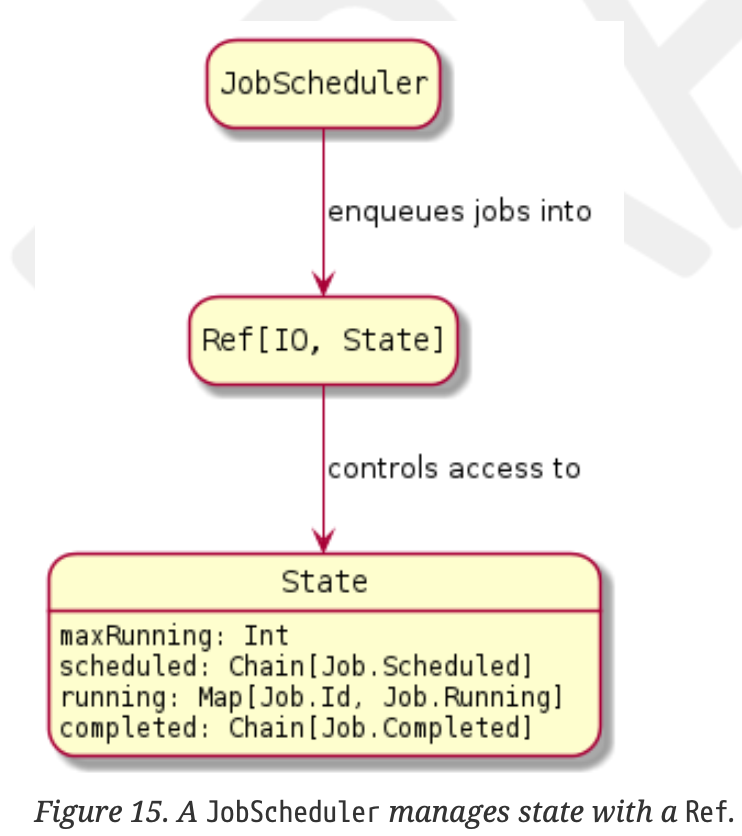
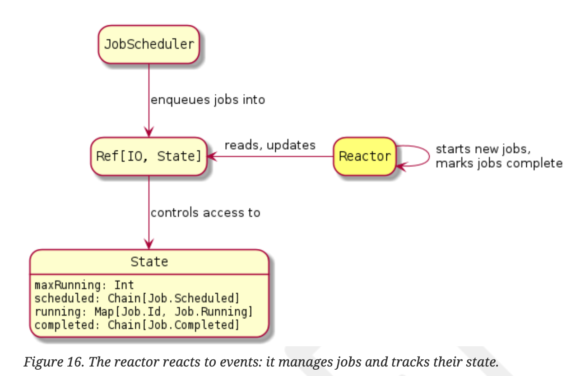
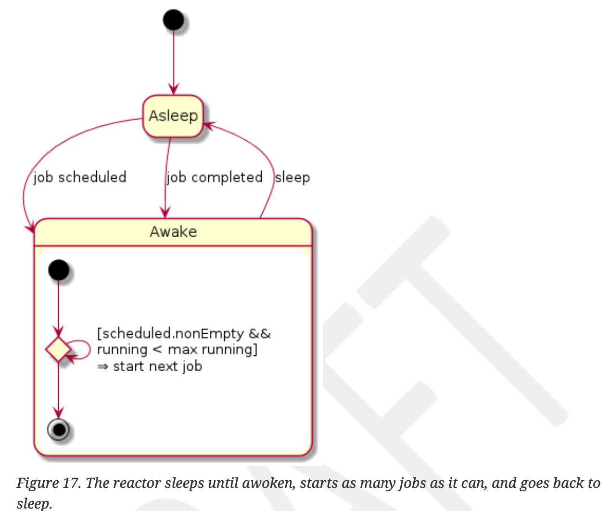
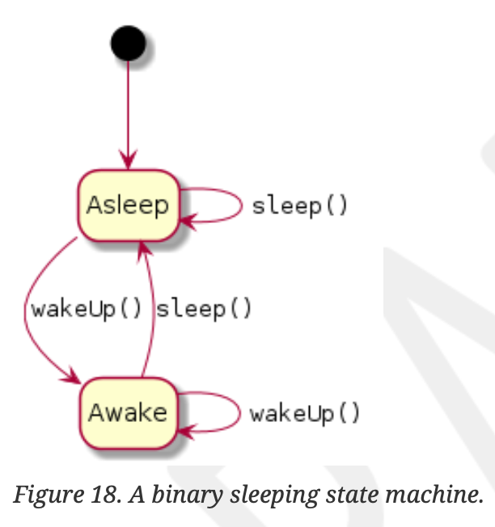

# 第10章 ケーススタディ：ジョブスケジューラ

効果を利用したプログラミングを実践するために、ジョブスケジューラを設計・実装してみましょう。スケジューラとは、ユーザが提出したジョブを、利用可能なリソースで実行するプロセスです。
まず、ジョブがどのように表現され、どのように状態を変化させるかについて説明します。そして、複数のジョブを同時に実行できるように管理します。そして、複数のジョブを同時に実行できるように管理します。スケジューラの設計を構築していく中で、次のような疑問にも答えていく必要があります。

reporting: 仕事の状況はどのように把握され、どのように報告されるのか？クライアントがフックを登録することで、非同期で通知されるようにできないか？
job control: クライアントがスケジュールされたジョブをキャンセルするにはどうしたらよいですか？
retry policies: ジョブが失敗したときに再試行できるか？ 異なるリトライポリシーを宣言するにはどうすればよいですか？
administration: スケジューラで利用可能な「ワーカー」を追加したり削除したりするには、どうすればよいのでしょうか。全体の処理能力に影響を与えるスケジューラーを追加・削除するには？その作業員に対してサーキットブレーカーを導入できないか。特定のワーカーが問題になった場合、そのワーカーをサービスから削除することはできますか？

これらのすべてを、深く掘り下げるか、あるいは練習問題として提案しながら、カバーしようと考えています。

## 10.1. Jobs

このケーススタディでのジョブは、実行させたい効果をカプセル化したものです。そしてスケジューラはジョブを状態から状態へ移行させます。例えば、ジョブがスケジュールされた後、実行能力があれば、スケジューラはそのジョブを実行することができます。


ジョブの状態を代数的なデータ型であるJobとして表現することができる。今のところフィールドは空のままにしておきます。

```scala
sealed trait Job
object Job {
  case class Scheduled() extends Job
  case class Running() extends Job
  case class Completed() extends Job
}
```

まず、すべてのジョブには識別子が必要なので、Job.Idという型を作りましょう。

```scala
object Job {
  // ...
  case class Id(value: UUID) extends AnyVal
  // ...
}
```

それぞれの状態について、スケジューラが必要とするデータを埋めていきましょう。

```scala
object Job {
  case class Scheduled(id: Id, task: IO[_]) extends Job // 1
  case class Running(
    id: Id,
    fiber: Fiber[IO, Either[Throwable, Unit]], // 2
    exitCase: Deferred[IO, ExitCase[Throwable]] // 2
  ) extends Job
  case class Completed(id: Id, exitCase: ExitCase[Throwable]) extends Job // 3
  // ...
}
```

1. スケジュールされたジョブには、実行されるエフェクトが含まれています。
2. 実行中のジョブには、実行中のエフェクトを表すFiberと、最終的なジョブ結果をExitCase値として保持するDeferredを持ち、最終的なジョブ結果をExitCase値として保持します。
3. 完了したジョブには、実際のジョブ結果がExitCaseの値として含まれる。

Job.Running と Job.Completed のケースで ExitCase タイプが使用されていることに気がつくと思います。
これは、Cats Effect のデータ型で、エフェクトが正常に完了したか、エラーが発生したか、キャンセルされたかを表します。簡単な定義は以下の通りです。

```scala
sealed trait ExitCase[+E]
object ExitCase {
  case object Completed extends ExitCase[Nothing] // 1
  case class Error[+E](error: E) extends ExitCase[E]
  case object Canceled extends ExitCase[Nothing]
}
```

1. Completedケースにはエフェクトが生成した値は含まれず、値が正常に生成されたことを知らせるだけであることに注意してください。

状態図に各状態の属性を記入すると、次のようになります。


図の「ノード」である「状態」を実装しました。エッジ "はどうでしょうか？
ある状態から次の状態へジョブを変換するメソッドです。
まず、idを生成してタスクをラップすることで、スケジュールされたジョブを作ってみましょう。

```scala
object Job {
  // ...
  def create[A](task: IO[A]): IO[Scheduled] =
    IO(Id(UUID.randomUUID())).map(Scheduled(_, task))
  // ...
}
```

次に、Job.Scheduled を Job.Running に変換するために、タスクを開始し、最終的な完了状態を ExitCase 値として取得する必要があります。

```scala
object Job {
  // ...
  case class Scheduled(id: Id, task: IO[_]) extends Job {
    def start(implicit cs: ContextShift[IO]): IO[Job.Running] =
      for {
        exitCase <- Deferred[IO, ExitCase[Throwable]] // 1
        fiber <- task.void
          .guaranteeCase(exitCase.complete) // 2
          .start // 3
      } yield Job.Running(id, fiber, exitCase) // 4
  }
  // ...
}
```

1. タスクの最終的なExitCaseを保持するために、空のDeferred値を作成します。
2. 遅延されたExitCase値を補完するためにguaranteeCaseコンビネータを使用する。その名の通り，与えられた関数は，タスクの実行中に何が起こっても
3. エフェクトを開始し、トラッキングのために保持するFiberを返します。
4. Job.Runningの値を得ることができます。

最後に、Job.RunningをJob.Completedに変換し、Deferredの終了ケース値の完了を待ちます。

```scala
object Job {
  // ...
  case class Running(
    id: Id,
    fiber: Fiber[IO, Unit],
    exitCase: Deferred[IO, ExitCase[Throwable]]
  ) extends Job {
    val await: IO[Completed] =
      exitCase.get.map(Completed(id, _)) // 1
  }
  // ...
}
```

1. 実行中のタスクによってExitCase値が生成されるまで、（Deferredのgetメソッドによって）意味的にブロックします。それを新しい Job.Completedの値でラップします。


## 10.2. Job scheduler

個々のジョブの挙動をモデル化した後、スケジューラの設計に移ります。スケジューラの役割は以下の通りです。

1. 受信したタスクをスケジュールされたジョブとして受け取ることができます。
2. そのジョブを実行し、各ステートでジョブの移行を行う。

Cats Effectで利用できるツールやテクニックに目を通すと、複数のジョブを並行して実行するためにparSequenceのようなpar-prefixedメソッドを使用したり、同時実行タスクにFiberを使用したりと、シンプルなスケジューラを想像することができます。しかし、Cats Effectのこれらの構成は不透明です。同時に実行されているエフェクトの数、あるいは実行を待っているエフェクトの数を、正当な理由に基づいて抽象化しています。このスケジューラでは、これらの概念を再定義（具体化）して、どの効果が「キューに入っている」のか「実行中」なのか、などを「見える」ようにする必要があります。

スケジューラの最初の責務であるタスクのスケジューリングのためのインターフェイスを作ろう。タスクが受け付けられると、スケジュールされたジョブの識別子を返します。

```shell
trait JobScheduler {
  def schedule(task: IO[_]): IO[Job.Id] // 1
}
```

1. タスクが生成する値の型は気にしないので、その型を「忘れる」のである。

残りの責務として、スケジューラはジョブとその状態を管理します。

```scala
object JobScheduler {
  case class State(
    maxRunning: Int, // 1
    scheduled: Chain[Job.Scheduled] = Chain.empty, // 2
    running: Map[Job.Id, Job.Running] = Map.empty, // 3
    completed: Chain[Job.Completed] = Chain.empty  // 4
  )
  // ...
}
```

1. 実行中のジョブの最大数
2. スケジュールされたジョブのキューは、効率的に実行する最初のジョブをデキューし、新しくスケジュールされたジョブを構造の後部にエンキューするために、cats.data.Chainとしてモデル化されている
3. 実行中のジョブはidでインデックス化され、簡単に検索できます。
4. 完了したジョブは一旦蓄積される

状態そのものはRef値の中で管理され、更新がアトミックに実行されることを保証する。



以下は、ある状態を管理するJobSchedulerの簡単な実装です。

```scala
def scheduler(stateRef: Ref[IO, State]): JobScheduler =
  new JobScheduler {
    def schedule(task: IO[_]): IO[Job.Id] =
      for {
        job <- Job.create(task) // 1
        _ <- stateRef.update(_.enqueue(job)) // 2
      } yield job.id
  }
```

1. IOタスクからJob.Scheduledの値を作成します。
2. Refが管理するStateにジョブをエンキューする。

```scala
def enqueue(job: Job.Scheduled): State =
  copy(scheduled = scheduled :+ job)
```

## 10.3. ジョブの状態変化への対応

ジョブをスケジュールするとしたら、スケジュールされたジョブをJob.Runningの状態に移行させるにはどうしたらよいでしょうか。

```scala
val jobId: IO[Job.Id] = scheduler.schedule(IO("whee").debug) // 1
```

1. 投稿後、実際にこのタスクを実行するのは何でしょうか？

リアクターが必要です。リアクターは、新しくスケジュールされたジョブのような、ジョブの状態変化を継続的に待ちます。
ジョブの状態の変化を継続的に待ち、変化が起きると反応します



この反応サイクルはステートマシンとしてモデル化することができ、リアクターは抽象的に言えば、眠っているか起きているかのどちらかである。

寝ている時: 何も起きない。新しいジョブがスケジュールされたり、実行中のジョブが完了すると、私たちは起こされます。
起きている時: スケジュールされたジョブが少なくとも1つあり、実行中のジョブがmaxRunningより少ない場合
1. 次のスケジュールされたジョブの待ち行列を解除する
2. 始める
3. 実行中とする
4. ジョブが完了したら、完了マークを付け、実行ループが起動するようにします。

そして、眠りにつく



具体的には、Reactorは管理されたスケジューラのStateに作用するwhenAwakeエフェクトを提供します。同時に、もしジョブの状態が遷移したら、onStartとonCompleteのコールバック効果に通知されます。特にスリープやウェイクを管理することはありません-それは次のセクションで統合します。

```scala
trait Reactor {
  def whenAwake(
    onStart: Job.Id => IO[Unit],
    onComplete: (Job.Id, ExitCase[Throwable]) => IO[Unit]
  ): IO[Unit]
}
```

### 10.3.1. リアクターの実装

次に、JobScheduler インターフェースで共有される Ref[IO, JobScheduler.State] を使って実装します。

```scala
object Reactor {
  def apply(stateRef: Ref[IO, JobScheduler.State])(
    implicit cs: ContextShift[IO]
  ): Reactor =
    new Reactor {
      def whenAwake(
        onStart: Job.Id => IO[Unit],
        onComplete: (Job.Id, ExitCase[Throwable]) => IO[Unit]
      ): IO[Unit] = {
        startNextJob // 1
          .iterateUntil(_.isEmpty) // 2
          .void
      }
    }
}
```

1. startNextJob は以下のように定義されています。これは、もしジョブが開始されていれば、開始されたジョブを含む Option[Job.Running] を返します。
2. iterateUntilコンビネータは、結果が述語と一致するまで与えられた効果を実行します。

startNextJobの効果を紐解いてみましょう。

```scala
def startNextJob: IO[Option[Job.Running]] =
  for {
    job <- stateRef.modify(_.dequeue) // 1
    running <- job.traverse(startJob) // 2
  } yield running
```

1. 共有状態を変更し、スケジュールされたジョブが開始可能な場合は待ち行列を解除する。
2. traverseを使って起動：JobはOption[Job.Scheduled]で、startJobはJob.Scheduled ⇒ IO[Job.Running] なので、結果の型は IO[Option[Job.Running]] となります。

Stateのdequeueメソッドは、スケジュールされたジョブがあることを確認し、さらに開始することができます。

```scala
def dequeue: (State, Option[Job.Scheduled]) =
  if (running.size >= maxRunning) this -> None // 1
  else
    scheduled.uncons .map {
      case (head, tail) =>
        copy(scheduled = tail) -> Some(head) // 2
    }
  .getOrElse(this -> None) // 3
```

1. キャパシティがない限り、仕事を増やすべきではない
2. 最初にスケジュールされたジョブを開始する必要があります
3. 開始する予定のジョブがない

startJob はスケジュールされたジョブを Job.Running に変換し、開始されるとそれを実行中としてマークし、ジョブが完了すると完了としてマークされ、実行ループが起動されることを保証します。

```scala
def startJob(scheduled: Job.Scheduled): IO[Job.Running] =
  for {
    running <- scheduled.start // 1
    _ <- stateRef.update(_.running(running)) // 2
    _ <- registerOnComplete(running) // 3
    _ <- onStart(running.id).attempt // 4
  } yield running
```

1. スケジュールされたジョブを開始し、Job.Running 値を生成します。ファイバーがフォークされ、Job.Running 値の中で参照されていることに注意してください。
2. ランニングは、以下のように定義されるStateの方法です。
   ```scala
   def running(job: Job.Running): State = copy(running = running + (job.id -> job))
   ```
3. registerOnCompleteはエフェクトをフォークしてジョブの完了を待ち、状態を更新し、リスナーに通知します。
   ```scala
   def registerOnComplete(job: Job.Running) = job.await
     .flatMap(jobCompleted) .start
   def jobCompleted(job: Job.Completed): IO[Unit] = stateRef
     .update(_.onComplete(job))
     .flatTap(_ => onComplete(job.id, job.exitCase).attempt)
   ```
4. onStartコールバックを呼び出し、リスナーにジョブが開始されたことを通知します。

TODO: この設計を、制御のためにミューテックス/セマフォを使用することと比較/対照してください。
TODO: コールバックベースの実装を教育目的で使用。イベントトリガーにもっと並行処理プリミティブを使用するか、fs2 のようなものを使用することも可能。

### 10.3.2. バイナリ スリーピング ステートマシン

このリアクターには、眠りと目覚めの2つの状態と、それらの間の効果的な遷移が必要です。これらの状態をモデル化したステートマシンを抽出しよう。



コードとしては、トランジションメソッドがインターフェイスを形成しています

```scala
trait Zzz {
  def sleep: IO[Unit] // 1
  def wakeUp: IO[Unit] // 2
}
```

1. wakeUpが呼び出されるまでスリープ（セマンティックブロック）する。
2. スリーパーを起こす（意味的にブロックを解除する）。すでに起きている場合は効果がない。

### 10.3.3. 原子炉をスリープ、アウェイクさせる

スリープ/アウェイクのZzzステートマシンができたので、これをリアクターに接続します。

1. ジョブが発生したら zzz.wakeUp でリアクターを起動する。
   1. 予定されている
   2. 仕上げる
2. リアクターは起こされるまでzzz.sleepし、その後reactor.whenAwakeを実行して再びスリープに入ります。

1つ目は、JobSchedulerの初期実装の動作を拡張し、ジョブがスケジュールされた後にwakeUpするようにしました。

```scala
def scheduler(schedulerState: Ref[IO, State], zzz: Zzz): JobScheduler =
   new JobScheduler {
     def schedule(task: IO[_]): IO[Job.Id] =
        for {
          job <- Job.create(task)
          _ <- schedulerState.update(_.enqueue(job)) _ <- zzz.wakeUp // 1
        } yield job.id
   }
```

1. ジョブがスケジュールされたら、起床する。

第二に、ジョブが完了したときにリアクターを起動します。

```scala
def reactor(schedulerState: Ref[IO, State], zzz: Zzz): Reactor =
   new Reactor(
     schedulerState,
     onStart = ???,
     onComplete = (id, exitCase) => zzz.wakeUp 1
   )
```

1. ジョブが完了したら、ウェイクアップ

最後に、眠り-目覚め-眠りの遷移のために、ループを作成します。

```scala
def loop(zzz: Zzz, reactor: Reactor): IO[Nothing] =
   (zzz.sleep *> reactor.whenAwake(onStart, onComplete)) // 1
     .foreverM // 2
```

1. 目覚めるまで眠り、whenAwakeエフェクトを実行する。これを繰り返す...
2. ... foreverMコンビネータによって、どんなモナドでも利用できる。ループを抜けることはないので、この効果の値の型はNothingである。[31]

[31] Nothing型の値は存在しないので、決して生成することはできず、この効果は決して終了できないことを意味します。

## 10.4. すべてをまとめる

これで、欲しい動作を実装したコンポーネントが揃いました。

1. タスクのキューイングを行うJobScheduler。
2. スケジュールされたジョブを開始し、完了したジョブを処理するためのReactor。
3. リアクターが起動し、再びスリープ状態になるループ効果

これらのクライアントとして、これらの価値や効果をマネージド・リソースとして提供することができます

```scala
object JobScheduler {
  def resource(maxRunning: Int)(
    implicit cs: ContextShift[IO]
  ): IO[Resource[IO, JobScheduler]] =
    for {
      schedulerState <- Ref[IO].of(JobScheduler.State(maxRunning)) zzz <- Zzz.asleep
      scheduler = new JobScheduler {
        def schedule(task: IO[_]): IO[Job.Id] =
          for {
            job <- Job.create(task)
            _ <- schedulerState.update(_.enqueue(job)) _ <- zzz.wakeUp
          } yield job.id
      }
      reactor = Reactor(schedulerState)
      onStart = (id: Job.Id) => IO.unit
      onComplete = (id: Job.Id, exitCase: ExitCase[Throwable]) => zzz.wakeUp
      loop = (zzz.sleep *> reactor.whenAwake(onStart, onComplete)).foreverM
    } yield loop.background.as(scheduler)
}
```

バックグラウンドでは、IO から Fiber をフォークして Resource として管理するため、Resource の使用効果が完了すると Fiber がキャンセルされることを思い出してください。ループを呼び出し元に公開せず、代わりに JobScheduler を「バックグラウンド化」されたループのライフタイムにスコープしています。

私たちのアプリケーションでは、このような動作をさせたいのです。私たちが望むようにスケジューラを使用すれば、すべてがシャットダウンされます。

```scala
for {
  resource <- JobScheduler.resource(maxRunning = 2)
  _ <- resource.use { scheduler =>
         ??? // 1
       } //2
} yield ???
```

1. スケジューラーを思う存分使ってください。でも...
2. ...使用効果が完了すると、（隠された）ループはキャンセルされ、Reactorへの内部通知が停止します。リアクターへの内部通知も停止します。

## 10.5. 概要

ジョブやその状態、振る舞いをモデル化するために、以下の手法を用いました。

1. ジョブの状態をジョブ代数データ型として表現する。
2. 効果的なメソッドでジョブ状態間を遷移させる、など。Job.Scheduled.start(): IO[Job.Running].
3. 実行中のジョブの場合
   1. 実行中のエフェクトをFiberとしてモデル化（4.2項 「Fiberによる制御の獲得」）。
   2. ExitCaseの結果をDeferredの値として使用するモデル (9.2節 "Write-once synchronization with Deferred "を参照)

ジョブスケジューラです。

1. JobScheduler.Stateの値をRefで管理する。
2. Zzz.wakeUp効果でReactorを覚醒させます。

リアクターは次のようにイベントに反応します。

1. Refで状態を管理する
2. ジョブの完了を待つフォーク効果

これらのコンポーネントを連携させるために

1. Zzzの協調動作は、並行状態機械として実装されている
2. 反応ループの寿命はResourceで管理しますが、そのユーザーにはJobSchedulerの値だけを公開します
