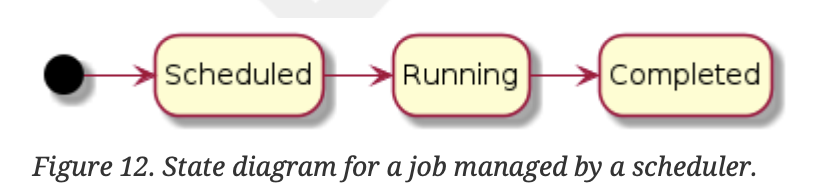
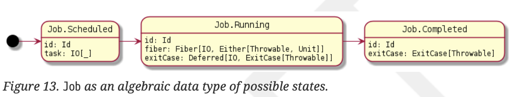
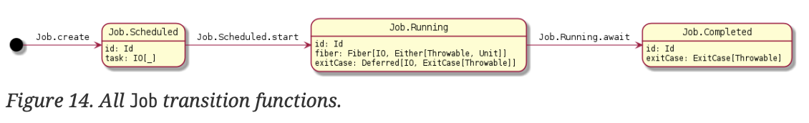

# 第10章 ケーススタディ：ジョブスケジューラ

効果を利用したプログラミングを実践するために、ジョブスケジューラを設計・実装してみましょう。スケジューラとは、ユーザが提出したジョブを、利用可能なリソースで実行するプロセスです。
まず、ジョブがどのように表現され、どのように状態を変化させるかについて説明します。そして、複数のジョブを同時に実行できるように管理します。そして、複数のジョブを同時に実行できるように管理します。スケジューラの設計を構築していく中で、次のような疑問にも答えていく必要があります。

reporting: 仕事の状況はどのように把握され、どのように報告されるのか？クライアントがフックを登録することで、非同期で通知されるようにできないか？
job control: クライアントがスケジュールされたジョブをキャンセルするにはどうしたらよいですか？
retry policies: ジョブが失敗したときに再試行できるか？ 異なるリトライポリシーを宣言するにはどうすればよいですか？
administration: スケジューラで利用可能な「ワーカー」を追加したり削除したりするには、どうすればよいのでしょうか。全体の処理能力に影響を与えるスケジューラーを追加・削除するには？その作業員に対してサーキットブレーカーを導入できないか。特定のワーカーが問題になった場合、そのワーカーをサービスから削除することはできますか？

これらのすべてを、深く掘り下げるか、あるいは練習問題として提案しながら、カバーしようと考えています。

## 10.1. Jobs

このケーススタディでのジョブは、実行させたい効果をカプセル化したものです。そしてスケジューラはジョブを状態から状態へ移行させます。例えば、ジョブがスケジュールされた後、実行能力があれば、スケジューラはそのジョブを実行することができます。



ジョブの状態を代数的なデータ型であるJobとして表現することができる。今のところフィールドは空のままにしておきます。

```scala
sealed trait Job
object Job {
  case class Scheduled() extends Job
  case class Running() extends Job
  case class Completed() extends Job
}
```

まず、すべてのジョブには識別子が必要なので、Job.Idという型を作りましょう。

```scala
object Job {
  // ...
  case class Id(value: UUID) extends AnyVal
  // ...
}
```

それぞれの状態について、スケジューラが必要とするデータを埋めていきましょう。

```scala
object Job {
  case class Scheduled(id: Id, task: IO[_]) extends Job // 1
  case class Running(
    id: Id,
    fiber: Fiber[IO, Either[Throwable, Unit]], // 2
    exitCase: Deferred[IO, ExitCase[Throwable]] // 2
  ) extends Job
  case class Completed(id: Id, exitCase: ExitCase[Throwable]) extends Job // 3
  // ...
}
```

1. スケジュールされたジョブには、実行されるエフェクトが含まれています。
2. 実行中のジョブには、実行中のエフェクトを表すFiberと、最終的なジョブ結果をExitCase値として保持するDeferredを持ち、最終的なジョブ結果をExitCase値として保持します。
3. 完了したジョブには、実際のジョブ結果がExitCaseの値として含まれる。

Job.Running と Job.Completed のケースで ExitCase タイプが使用されていることに気がつくと思います。
これは、Cats Effect のデータ型で、エフェクトが正常に完了したか、エラーが発生したか、キャンセルされたかを表します。簡単な定義は以下の通りです。

```scala
sealed trait ExitCase[+E]
object ExitCase {
  case object Completed extends ExitCase[Nothing] // 1
  case class Error[+E](error: E) extends ExitCase[E]
  case object Canceled extends ExitCase[Nothing]
}
```

1. Completedケースにはエフェクトが生成した値は含まれず、値が正常に生成されたことを知らせるだけであることに注意してください。

状態図に各状態の属性を記入すると、次のようになります。



図の「ノード」である「状態」を実装しました。エッジ "はどうでしょうか？
ある状態から次の状態へジョブを変換するメソッドです。
まず、idを生成してタスクをラップすることで、スケジュールされたジョブを作ってみましょう。

```scala
object Job {
  // ...
  def create[A](task: IO[A]): IO[Scheduled] =
    IO(Id(UUID.randomUUID())).map(Scheduled(_, task))
  // ...
}
```

次に、Job.Scheduled を Job.Running に変換するために、タスクを開始し、最終的な完了状態を ExitCase 値として取得する必要があります。

```scala
object Job {
  // ...
  case class Scheduled(id: Id, task: IO[_]) extends Job {
    def start(implicit cs: ContextShift[IO]): IO[Job.Running] =
      for {
        exitCase <- Deferred[IO, ExitCase[Throwable]] // 1
        fiber <- task.void
          .guaranteeCase(exitCase.complete) // 2
          .start // 3
      } yield Job.Running(id, fiber, exitCase) // 4
  }
  // ...
}
```

1. タスクの最終的なExitCaseを保持するために、空のDeferred値を作成します。
2. 遅延されたExitCase値を補完するためにguaranteeCaseコンビネータを使用する。その名の通り，与えられた関数は，タスクの実行中に何が起こっても
3. エフェクトを開始し、トラッキングのために保持するFiberを返します。
4. Job.Runningの値を得ることができます。

最後に、Job.RunningをJob.Completedに変換し、Deferredの終了ケース値の完了を待ちます。

```scala
object Job {
  // ...
  case class Running(
    id: Id,
    fiber: Fiber[IO, Unit],
    exitCase: Deferred[IO, ExitCase[Throwable]]
  ) extends Job {
    val await: IO[Completed] =
      exitCase.get.map(Completed(id, _)) // 1
  }
  // ...
}
```

1. 実行中のタスクによってExitCase値が生成されるまで、（Deferredのgetメソッドによって）意味的にブロックします。それを新しい Job.Completedの値でラップします。



## 10.2. Job scheduler
