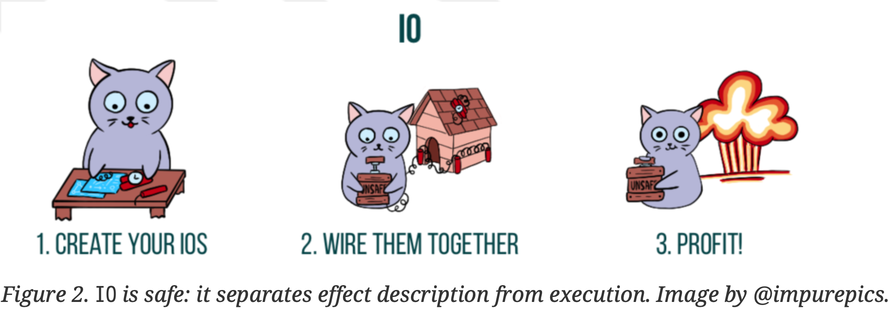

# 第2章. Cats Effect IO

mapやflatMapなどのメソッドを用いて新しい動作を構成する能力を維持しつつ、副作用を遅延させる方法を理解するために、独自のMyIOエフェクトタイプを構築しました。次に、同じプロパティを持つ cats.effect.IO タイプを紹介し、IO 値の典型的な構成、変換、実行の方法を簡単に紹介します。また、cats.effect.IOAppでエフェクトを使ったアプリケーションを構築する方法を紹介します。

## 2.1. IO値の構築

多くの場合、IO.delay を使って副作用を IO 値として捕らえることになるでしょう。

```scala
def delay[A](a: => A): IO[A]
```

IO.delay は call-by-name (遅延評価) の引数を取り，コードの評価を遅延させます。

```scala
val hw: IO[Unit] = IO.delay(println("Hello world!")) // 1
```

1. この式の評価を遅らせて、（後で）実行されたときにコンソールに Hello world と表示され、値 () が生成されます。

※ IO.applyはIO.delayの別名です。これにより、IO.delay(...)の代わりにIO(...)と書くことができます。

効果が実行されたとき、副作用で例外が投げられたらどうなるのでしょうか？例えば、このようなIO値を作成するとどうなりますか？

```scala
val ohNoes: IO[Int] =
  IO.delay(throw new RuntimeException("oh noes!"))
```

この効果は IO[Int] 型であるにもかかわらず、throw のために Int を生成できないことが分かっています。しかし、throwの副作用はIOが実行されるまで遅延され、そのときだけ例外をスローします。

あまり一般的ではありませんが、既存の「純粋な」値から IO 値を構築することもできます。

```scala
val twelve: IO[Int] = IO.pure(12)
```

注意! IO.pure を呼ぶときに副作用を実行しないでください。なぜなら、それらはeagerlyに評価され、それによって置換が壊れるからです。もし自信がなければ、安全のために IO.delay か IO.apply を使ってください。

IOが成功した場合に「期待される」型を明示的に、あるいは型推論によって提供する限り、例外をIOに「持ち上げる」ことも可能です。

```scala
val ohNoes: IO[Int] =
  IO.raiseError(new RuntimeException("oh noes!")) // 1
```
1. IO.delay の呼び出しで例外を発生させた前回の演習と IO.raiseError の使い方の違いに注意してください．ここでは、すでに例外を値として持っています。

これは一般的な代替効果タイプなので， scala.concurrent.Future の値を IO 値に変換する一般的な方法があります．

```scala
def futurish: Future[String] = ???
val fut: IO[String] = IO.fromFuture(IO(futurish)) // 1
```

Q. FutureをIOに変換しているのですが、IO内部のFutureを渡すように要求されています。それはなぜだと思いますか？
A. 思い起こせば、Futureはその構築中に実行が予定されています。しかし、IO効果はその実行を遅らせなければならないので、Futureの作成をそれ自身のIO値でラップすることによって、Futureを遅らせるのです。

[メモ]
essentialEffect.Chapter_2.scalaファイルでの検証結果まとめる

## 2.2. IO値の変換

IO値があれば、様々なメソッドを呼び出して新しいIO値を生成することができます。 これらのメソッドはしばしばコンビネータと呼ばれます。

```scala
IO(12).map(_ + 1) // 1
```
1. When executed, produces 13.

IOはアプリケ-ションであり、Nを2つ以上の値に対応させることができる

```scala
(IO(12), IO("hi")).mapN((i, s) => s"$s: $i") // 1
```

1. When executed, produces "hi: 12".

IOはモナドであり、その上をflatMapすることができる。もっと便利なのは、for -comprehensionを使うことである。

```scala
for
  i <- IO(12)
  j <- IO(i + 1)
yield j.toString // 1
```

1. 実行すると、"13 "を生成する。

他にも多くのコンビネーターがあります。

### 2.2.1. エラー処理

これまで見てきたように，IO 計算は実行中に例外を発生させたり，IO.raiseError によって既存の例外をキャプチャすることによって，失敗することがあります．しかし，このような失敗を検出して，何か対処することはできます．エラー処理のための一般的なコンビネータは handleErrorWith で、エラー値を受け取る以外は flatMap と同じようなシグネチャを持つ。

```scala
def handleErrorWith[AA >: A](f: Throwable => IO[AA]): IO[AA]
```

新たなエフェクトを出すことでエラーに対処しています。

```scala
val ohNoes  = IO.raiseError[Int](new RuntimeException("oh noes!"))
val handled = ohNoes.handleErrorWith(_ => IO(12))
```

単に成功した値を提供したい場合は、handleError を使用することができます。

```scala
ohNoes.handleError(_ => 12)
```

しかし、handleErrorWithは成功する効果を生み出す必要はなく、それ自体が失敗する効果を生み出すことができる。

```scala
val handled: IO[Int] = ohNoes.handleErrorWith(t => IO.raiseError(new OtherException(t)))
```

もし、明示的にエラーを別のエラーに変換したい場合は、代わりにadaptErrorを使うことができます。

```scala
ohNoes.adaptError(t => new OtherException(t))
```

例えば、あるメソッドは IO[Int] を返すかもしれませんが、それは handleErrorWith 呼び出しによって生成されたかもしれません。この代わりに、エラーを Either 値に変換して処理するという面白い方法があります。つまり、 IO[A] は IO[Either[Throwable, A]] になります。

```scala
def attempt(): IO[Either[Throwable, A]]
```

エラー処理を隠すのではなく、エラーを公開する。 エラーを（成功した）IO値に「持ち上げる」ことで、エラー処理を遅らせています。

```scala
val attempted: IO[Either[Throwable, Int]] = ohNoes.attempt
```

####  エラー処理決定木

IO[A]にエラーが発生したら何をしたいですか？

Q. 効果を発揮する？
A. `onError(pf: PartialFunction[Throwable, IO[Unit]])` を使用します。

Q. どんなエラーも別のエラーに変換する？
A. `handleError(f: Throwable ⇒ A): IO[A]`を使用します。

Q. ある種のエラーを成功値に変換する？
A. `recover(pf: PartialFunction[Throwable, A]): IO[A]` を使用します。

Q. ある種のエラーを別の効果に変換する？
A. `recoverWith(pf: PartialFunction[Throwable, IO[A]]): IO[A]` を使用します。

Q. エラーは見えるようにするが、エラー処理は遅らせる？
A. `attempt: IO[Either[Throwable, A]]` を使用します。

Q. その他
A. `handleErrorWith(f: Throwable ⇒ IO[A]): IO[A]`を使用します。

## 2.3. IO値の実行

副作用はIO値にカプセル化することで遅延させています。プログラムの作成が完了したら、いよいよ副作用を実行します。実行する方法はいくつかありますが、副作用が実行され、置換処理が適用されないことを示すために、すべてに unsafe という接頭辞が付けられています。

最もよく遭遇する安全でないメソッドは unsafeRunSync です。Run は実行、sync は同期実行を意味し、ともに効果を同期的に実行し、その結果を返します。IO[A] に対して unsafeRunSync を呼び出すと、効果が成功した場合に A タイプの値が生成されます。

```scala
def unsafeRunSync: A
```

例えば:

```scala
IO("hello world!").unsafeRunSync
```

これは、値 "hello world!" を生成します。エフェクトが実行中に例外をスローした場合、または IO.raiseError で直接作成された場合、その例外は unsafeRunSync からスローされるでしょう。

当然ながら unsafeRunAsync や他のメソッドもありますが、使用頻度は低いです。しかし、より一般的なのは unsafeToFuture メソッドで、これは scala.concurrent.Future を消費するレガシーインターフェースとあなたの効果的なコードを統合するために使用することができます。

```scala
def unsafeToFuture: Future[A]
```

しかし、もう一度警告します! 一般的なルールとして、コードの中で安全でないメソッドを呼び出すべきではありません。REPLやその他の使い捨てのコードで実験しているときは、もちろんそうです。そうでなければ、やってはいけません! その代わり、この責任は後述のIOAppのような型に委ねることになります。しかし、最初にcats.effect.IOがエフェクトかどうかを確認します。

## 2.4. 効果としてのIO

IOをEffect Patternのチェックリストに照らして評価してみましょう。

####  Effect Pattern Checklist: IO[A]の場合

1. プログラムの種類でわかるのか
1. どのような効果をもたらすのか、そして

```IOは、（おそらく）副作用のある計算を表します。```
2. どのような価値を生み出すのか？

```計算が成功した場合、A タイプの値。```
2. 外部から見える副作用が必要な場合、その効果の記述は実行と分離されているか？ 実行とは別のものか？

   ```外部から見える副作用が必要：実行されると、IOは副作用を含め、何でもできるようになる。IO値を各種コンストラクタで記述し、複合効果をmap, mapN, flatMapなどのメソッドで合成して記述する。効果の実行は、unsafe*なメソッドが呼ばれたときのみ行われる。```

したがって、IOは効果である。



## 2.5. IOAppによるアプリケーションでのエフェクトの実行

アプリケーションに効果を組み込むにはどうすればよいのだろうか。副作用がある場合、プログラムの記述と実行を分離する。そして、アプリケーションはこの構造を反映する。

1. 起こしてほしい効果を説明する。
2. アプリケーションを実行すると、それらが実行されるのです。

そのために、Cats EffectはアプリケーションのためのIOApp型を提供します。IOAppは実行可能なScala型（mainメソッドを持つもの）で、エフェクトを単一のIO値として宣言する必要があり、それらのエフェクトを実行するタスクを実行します。

例えば:

```scala
package sample.effect

import cats.effect.*

object HelloWorld extends IOApp: // 1
   def run(args: List[String]): IO[ExitCode] = // 2
     helloWorld.as(ExitCode.Success) // 3
   val helloWorld: IO[Unit] = IO(println("Hello world!"))
```

1. アプリケーションはオブジェクトである必要があり、IOAppを拡張する必要があります。
2. アプリケーションのエントリポイントは run メソッドであり、run メソッドは以下の値を返す必要がある。 IO[ExitCode]を返します。
3. 実行される計算を宣言する。

IOAppの抽象的なrunメソッドでは、IO値を返す必要があります。IOApp はどのようにエフェクトを実行するのですか？IO は unsafeRunSync のような安全でないメソッドが呼ばれたときだけ実行されるので、 IOApp がそれを呼び出してくれる必要があります。

このアプリケーションの効果は、アプリケーションの終了時にオペレーティングシステムに返す終了コードを抽象化した列挙体であるExitCodeを生成します。ほとんどのアプリケーションはExitCode.Successを返しますが、常にExitCode.Errorを返すか、ゼロ以外の値がエラーを示す数値でExitCodeを構築することができます。

## 2.6. 概要

1. cats.effect.IOは、任意の副作用をカプセル化することができる効果です。
   1. コンストラクタは、純粋な値、遅延した副作用、エラーやFutureのような他の型からIOを生成します。
   2. コンビネータを使うと、新しいエフェクトを作ったり、その出力を変換したり、エラーを処理したりすることができます。すべてのコンビネータはエフェクトの実行を回避することが重要で、そうしないと置換が破綻します。
   3. IO[A]の値を実行することができます．その値は，A型の値を生成するか，例外を発生させるかのどちらかです．これらの値は，unsafe-prefixされたメソッドによって，プログラムのごく「端」で実行されるに過ぎません．
2. cats.effect.IOAppは、アプリケーションを、それが実行される1つのIO効果として記述することができます。
