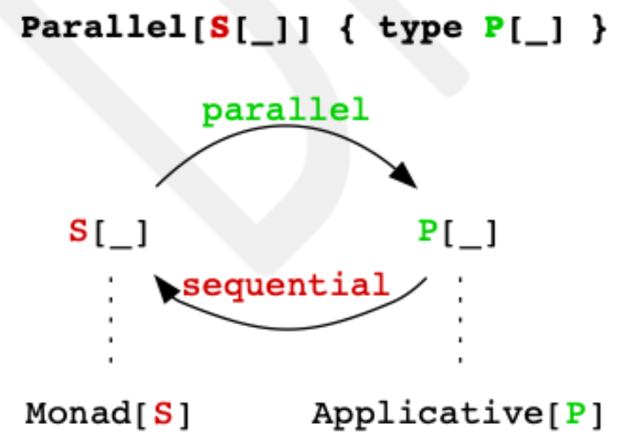
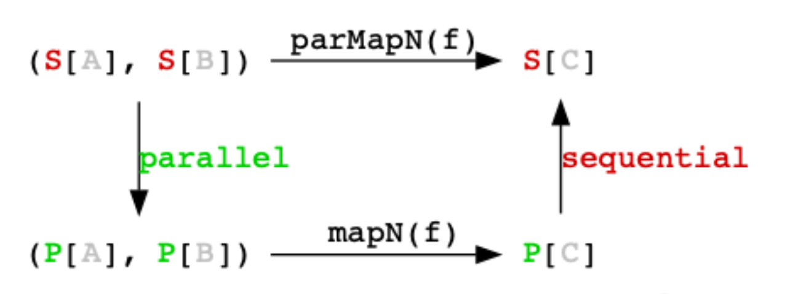

# 第3章. 並列実行

副作用をComposable IOデータ型として捕らえること自体は有用ですが、それができたら、もっと先に進むことができます。もし、互いに依存しない複数のIO値があれば、それらを並列に実行できるようにすべきではないでしょうか。そうすれば、全体の計算がより効率的になるはずです。

まず、IO自体が並列処理をサポートするかどうかを議論します。次に、IO がどのように並列処理をサポートするか、そして、その並列処理がどのように実装されるかについて説明します。そして、IO 値を並列に構成するさまざまな方法の例をいくつか見ていきます。

## 3.1. IOは並列処理をサポートしていますか？

IO が並列処理をサポートしているかどうかという問題に答えるために，まず類似のデータ型である scala.concurrent.Future と比較してみましょう．このデータ型は scala.concurrent.ExecutionContext を介して複数のスレッドで作業をスケジューリングすることにより並列処理をサポートしていることが分かっています。

複数のFuture値をflatMap（for-comprehension経由）とmapNの両方を使って合成してみよう。

下のコードで、hw1 の効果は hw2 の効果と同じですか？ hello と world は並列に実行されますか？コンソールにはどのような出力が表示されますか?

```scala
package sample.effect

import cats.implicits.*
import scala.concurrent.*
import scala.concurrent.duration.*

object Future1 extends App:
  given ExecutionContext = ExecutionContext.global
  val hello = Future(println(s"[${Thread.currentThread.getName}] Hello")) // 1
  val world = Future(println(s"[${Thread.currentThread.getName}] World")) // 1

  val hw1: Future[Unit] =
    for
      _ <- hello
      _ <- world
    yield ()

  Await.ready(hw1, 5.seconds) // 2
  
  val hw2: Future[Unit] = (hello, world).mapN((_, _) => ())

  Await.ready(hw2, 5.seconds) // 3
```

1. Futureの実行中に現在のスレッドを表示するためのヘルパーコードを追加しました。
2. hw1の効果は、同じなのか？
3. ...HW2の影響？

このプログラムを実行すると、次のような出力が得られます（スレッドIDは異なる場合があります）。

```shell
[scala-execution-context-global-10] Hello
[scala-execution-context-global-11] World
```

HelloとWorldのペアが1つだけ印刷されているのが見えます。なぜでしょうか？それは、Futureがアクションをイーガーリーにスケジュールし、その結果をキャッシュするからです。これはEffectパターンのルール2（安全でない副作用はFutureコンストラクタのような関数から分離して実行されない）を破ることになります。

申し訳ありません。Futureは副作用を熱心に実行することを思い出させる必要があると思いました。副作用をできるだけ遅らせるようにしましょう。

```scala
package sample.effect

import cats.implicits.*
import scala.concurrent.*
import scala.concurrent.duration.*

object Future2 extends App:
  given ExecutionContext = ExecutionContext.global
  def hello = Future(println(s"[${Thread.currentThread.getName}] Hello")) // 1
  def world = Future(println(s"[${Thread.currentThread.getName}] World")) // 1

  val hw1: Future[Unit] =
    for
      _ <- hello
      _ <- world
    yield ()

  Await.ready(hw1, 5.seconds) // 2
  
  val hw2: Future[Unit] = (hello, world).mapN((_, _) => ())

  Await.ready(hw2, 5.seconds) // 3
```

1. 前の例のFutureのキャッシュ動作を避けるために、valからdefに変更したことに注意してください。
2. hw1の効果は、同じなのか？
3. ...HW2の影響？


このプログラムを実行すると、次のような出力が得られます。

```shell
[scala-execution-context-global-10] Hello
[scala-execution-context-global-10] World
[scala-execution-context-global-11] World // 1
[scala-execution-context-global-10] Hello // 1
```

1. Hello!"の前に "Notice World "が表示されます。

出力は正しく、HelloとWorldの2組の出力を示しています。そして異なるスレッドで実行されているmapNを呼び出すことで、2組の出力が表示されます。

しかし、注意してください! たとえ2つの異なるスレッドで出力が起こっているのを見たとしてもそれは、それらの計算が並列に行われたことを意味しない。並列に実行されたことを示すにはどうしたらいいのでしょうか、それともそうでないのでしょうか？(この質問に答えることはあまり重要ではありません。)

同時に、hw2 の計算は実は非決定的なので、World の前に Hello と出力されることもあります。何が非決定的な出力にしているのでしょうか？

hw2 の効果は非決定的であるが、hw1 の実行、つまり for-comprehension を使用する計算については、1つのことが言える。なぜなら、world の効果は hello の値が計算された後にのみ生成（そしてその後実行）されるからです。

```scala
val hw1: Future[Unit] =
  hello.flatMap { _ => // 1
    world.map { _ =>
      ()
    }
  }
```

1. for-comprehensionは、ネストされた一連のflatMapの呼び出しである構文糖です。構文をデシュガーすると、hello の結果が flatMap に与えられた関数に渡されるため、hello の結果が計算された後にのみ world が実行されることがわかる。


一方、mapNを使うhw2は、helloとworldを並列に実行すると推察されます。それはなぜか？

hw2の定義を少し部分的に評価すると、何か重要なことが起こっているのがわかります。

```scala
val hw2: Future[Unit] =
  (
    Future(println(s"[${Thread.currentThread.getName}] Hello")), // 1
    Future(println(s"[${Thread.currentThread.getName}] World"))  // 2
  ).mapN(((_, _) => ())
```

1. 私たちは、フューチャーを構築すると、それがスケジュール化されることを知っています。
2. 2つ目のFutureもスケジュールされているので、今度は両方が独立して実行されることになります。

これは、Futureでは、flatMapとmapNは並列性に関して異なる効果を持つことを示している。

しかし、FutureのmapNが並列処理で実装され、flatMapが逐次処理で実装されているわけではないことに注意してください。この並列性は、Futureが計算のスケジューリングを熱心に行うことによる副次的な効果で、mapN自体が評価される前に行われるものです。

IOについてはどうでしょうか？mapNとflatMapを使い分けると、Futureのように効果が違うのでしょうか？

```scala
package sample.effect

import cats.effect.*
import cats.implicits.*

object IOComposition extends App:

  val hello = IO(println(s"[${Thread.currentThread.getName}] Hello")) // 1
  val world = IO(println(s"[${Thread.currentThread.getName}] World"))

  val hw1: IO[Unit] =
    for
      _ <- hello
      _ <- world
    yield ()

  val hw2: IO[Unit] = (hello, world).mapN((_, _) => ())

  hw1.unsafeRunSync() // 2
  hw2.unsafeRunSync() // 3

```

1. できるだけ一貫性を持たせるために、Futureを使ったこれまでの例と同等のコードを使っています。
2. hw1の効果は...？
3. ...HW2の影響？

IOCompositionプログラムの出力

```shell
[main] Hello
[main] World
[main] Hello
[main] World
```

現在、期待される出力が表示されていますが、すべてのスレッドが同じになっています。予想通りですか？

hw2は、先のFutureを使った例のように、非決定的な出力をするのでしょうか？

IOは、並列処理をサポートしません。なぜなら、Effect Patternのように、異なる効果には異なるタイプを持たせたいからです。

```
これは型クラスのコヒーレンスと呼ばれるものの結果でもある。型クラスの一貫性とは、一つの型に対して一つの型クラスのインスタンスしか存在してはいけないということで、IOのためのモナドのインスタンスは一つしか存在できない。同時に，すべてのMonadはApplicativeでもあるので，コヒーレンスによって，IOのためのユニークなApplicativeは，IOのための同じMonadのインスタンスでなければならない．このことは、mapN のような Applicative メソッドの使用は flatMap のような Monad メソッドの使用と同等であるべきだということも意味しています。つまり、本当に Monad を持っているなら、 fa.flatMap(_ => fb) という Monad 式を (fa, fb).mapN((_, b) => b) に書き換えれば「同じ」プログラムを生成することになるのです。型がモナドであることを「忘れて」違う動作をすることはないはずだ。
```

## 3.2. Parallel 型クラス

これまで見てきたように、Futureと違ってIO自体は並列性をサポートしない。 では、どうすれば実現できるのでしょうか。

今回もEffectパターンに従って、ルールその1「型は効果を反映するものであること」を適用します。

もしIOが並列処理をサポートしないなら、サポートする新しい型が必要です。cats.effectでは、この型はIO.Par（Parは「並列」の意）と名付けました。

※ Cats Effect 3から実装が変わった

```scala
sealed abstract class IO[+A] { ... } // 1

object IO {
  class Par[+A] { ... } // 2
  object Par {
    def apply[A](ioa: IO[A]): Par[A] = ??? // 3
    def unwrap[A](pa: Par[A]): IO[A] = ??? // 3
  }
}
```

1. (シーケンシャル)IOデータ型。
2. IOの並列データ型であるIO.Par.
3. IO値とIO.Par値の間で変換するためのメソッド。

IO.ParはMonadインスタンスを持ちません．なぜなら，複数のアクションの実行をシリアライズすることができないからです．その代わり，独立したIO.Parの値を合成するためのApplicativeインスタンスを持つことになります．

```scala

implicit def ap(implicit cs: ContextShift[IO]): Applicative[IO.Par] = // 1
  new Applicative[IO.Par] {
    def pure[A](a: A): IO.Par[A] = IO.Par(IO.pure(a))
    def map[A, B](pa: IO.Par[A])(f: A => B): IO.Par[B] = ???
    def product[A, B](pa: IO.Par[A], pb: IO.Par[B]): IO.Par[(A, B)] = ??? // 2
  }
```

1. 計算を別のスレッドに切り替えるには，ContextShift[IO] が必要です．ContextShift については第 5 章のコンテキストを切り替えるで詳しく説明するが，今のところ scala.concurrent.ExecutionContext やスレッドプールに近いものと考えてもらって構わない．
2. productの実装では、paとpbが異なるスレッドで実行されるように、csを使用します。

順次実行と並列実行を変換するときに、型を切り替えなければならないのは、ちょっと冗長ですね。次のようになります。

```scala
val ia: IO[A] = IO(???)
val ib: IO[B] = IO(???)
def f(a: A, b: B): C = ???
val ipa: IO.Par[A] = IO.Par(ia) // 1
val ipb: IO.Par[B] = IO.Par(ib) // 1
val ipc: IO.Par[C] = (ipa, ipb).mapN(f) // 2
val ic: IO[C] = IO.Par.unwrap(ipc) // 3
```

1. 各IOをIO.parに変換する。
2. 2つのIO.parをmapNで1つのIO.Parに並列に合成する．
3. IO.ParをIO.Parに翻訳し直します。

Catsライブラリ（Cats Effectではない）のParallel型クラスは、関連する2つのデータ型間の変換の概念を捉えています。

```scala
 trait Parallel[S[_]] { // 1
  type P[_] // 2
  def monad: Monad[S] // 3
  def applicative: Applicative[P] // 4
  def sequential: P ~> S // 5
  def parallel: S ~> P // 5
}
```

1. 型クラスインスタンスは、型S（シーケンシャルの場合）についてのものである。例えば、型クラスインスタンス Parallel[IO] があり、IO は変換されるシーケンシャル型である。
2. 型クラスインスタンスは、P 型（パラレルの場合）を定義する。Parallel[IO] typeclass インスタンスの場合，P は IO.Par となる．
3. S はモナドを持たなければならない．すなわち，Sを用いた操作はシーケンシャルでなければならない．
4. PはApplicativeを持たなければならない。すなわち，Pを用いた操作は，データ順序に依存してはならない．
5. 並列インスタンスは、逐次値から並列値への変換、およびその逆が可能であること。

つまり、P ~> Sはdef apply[A](pa: P[A])のようなコードと等価です。S[A].



図3. Parallel型クラスは，逐次型Sと並列型Pの間の変換を符号化する．

IOとIO.Parの翻訳をParallelの観点から書き直すと、次のようになります。

```scala
 
- val ipa: IO.Par[A] = IO.Par(ia)
- val ipb: IO.Par[B] = IO.Par(ib)
+ val ipa: IO.Par[A] = Parallel[IO].parallel(ia)
+ val ipb: IO.Par[B] = Parallel[IO].parallel(ib)

...

- val ic: IO[C] = IO.Par.unwrap(ipc)
+ val ic: IO[C] = Parallel[IO].sequential(ipc)
```

しかし，もっと良い方法がある．Parallel 型クラスのインスタンスが定義されると，この変換を自動的に行う関数の par -prefixed バージョンが逐次型上で利用できるようになるため，型の根本的な変化を見ることはない

明示的な逐次→並列→逐次の変換をparMapNメソッドに置き換えます。

```scala
val ic: IO[C] = (ia, ib).parMapN(f) // 1
```

1. par接頭辞に注目!

parMapN は，引数 ia と ib を IO.Par の値に変換し，IO.Par と mapN を介して並列に合成し，結果を IO.Par に戻す． IO.Par と mapN を使って並列に合成し，その結果を再び IO.Par に変換する．

この共通パターンを抽象化することで、どれだけのコードを節約できたか見てみましょう。



図 4.
parMapN 拡張手法は，(1)
逐次効果型を並列表現に変換し，(2)
代替 mapN を実行し， (3)
並列表現を逐次表現に戻す，という流れで実装されています．

## 3.3. 並列性の検査

parMapNをはじめとするParallel型クラスのメソッドは，並列処理を抽象化し，実際にどのように計算が行われるかの詳細を排除するのに役立ちます．しかし，その使い方を学ぶとき，何がどのように実行されているのか，どのように感じ取ればよいのでしょうか．

最も簡単な解決策は、実行中にコンソールに何かを表示することでしょう。私たちはそれが副作用であることを知っていますし、副作用をどうすればよいかも知っています：IOでラップするのです!

ヘルパーメソッドであるdebugを作成し、コードに追加しています。このインポートを追加するだけです。

```scala
import com.innerproduct.ee.debug._
```

これで、デバッグメソッドで効果値を拡張できるようになりました。

```scala
package sample.effect

import cats.effect.*
import cats.implicits.*
import com.innerproduct.ee.debug.*

object DebugExample extends IOApp:
  def run(args: List[String]): IO[ExitCode] =
    seq.as(ExitCode.Success)
  val hello = IO("hello").debug // 1
  val world = IO("world").debug // 1
  val seq = (hello, world)
    .mapN((h, w) => s"$h $w")
    .debug // 1
```

1. 実行中にコンソール出力を追加するためにdebugを使用します。

実行時に、デバッグメソッドは、現在のスレッドの名前と、エフェクトによって生成された値（toStringを呼び出すことによって生成された文字列として）を表示します。
（toStringを呼び出すことで生成される文字列として）。

```shell
[ioapp-compute-0] hello // 1
[ioapp-compute-0] world // 1
[ioapp-compute-0] hello world // 1
```

デバッグ用のソースは非常にシンプルで、与えられたエフェクトの値を現在のスレッドの名前とともにコンソールに出力する新しいエフェクトを生成します。

```scala
package sample.effect

import cats.effect._

/** `import com.innerproduct.ee.debug._` to access * the `debug` extension methods. */
object debug {
  /** Extension methods for an effect of type `IO[A]`. */
  implicit class DebugHelper[A](ioa: IO[A]) {
    /** Print to the console the value of the effect * along with the thread it was computed on. */
    def debug: IO[A] =
      for
        a

    <- ioa
    tn = Thread.currentThread.getName
    _ = println(s"[${Colorize.reversed(tn)}] $a") // 1
    yield a
  }
}
```

1. 別のヘルパーを使い、ターミナルでスレッド名にきれいな色を付けて、視覚的に区別できるようにしています。

## 3.4. parMapN

parMapNは、アプリケーティブなmapNメソッドの並列版です。複数のエフェクトの出力をどのように結合するかを指定することで、複数のエフェクトを並列に1つにまとめることができます。

```scala
val ia: IO[A] = IO(???)
val ib: IO[B] = IO(???)
def f(a: A, b: B): C = ???
val ic: IO[C] = (ia, ib).parMapN(f)
```

mapN と parMapN は任意のアリティのタプルに作用するので、任意の数の効果を一貫した方法で一緒に結合することができます。例えば

```scala
(ia, ib).parMapN((a, b) => ???) // 1
(ia, ib, ic).parMapN((a, b, c) => ???) // 2
(ia, ib, ic, id).parMapN((a, b, c, d) => ???) // 3
```

1. Two effects → one effect.
2. Three effects → one effect.
3. Four effects → one effect.

parMapN を使用するアプリケーションの例と、その内容を確認するためのデバッグを作成しましょう。

```scala
package essentialEffect

import cats.effect.*
import cats.implicits.*

object ParMapN extends IOApp:

  def run(args: List[String]): IO[ExitCode] =
    par.as(ExitCode.Success)

  val hello = IO("hello").debug // 1
  val world = IO("world").debug // 1

  val par = (hello, world)
    .parMapN((h, w) => s"$h $w") // 2
    .debug // 3

  extension [A](ioa: IO[A])
  def debug: IO[A] =
    for
      a <- ioa
  yield
  println(s"[${Thread.currentThread().getName}] $a")
  a
```

1. 実行されるIO値ごとにデバッグを行う（並列）。
2. 先ほどの例ではmapNではなくparMapNを使っています。
3. 構成されたIO値もデバッグします。何が出力されると思いますか？どのスレッドで実行されると思いますか？

ParMapNプログラムを実行すると、次のような結果が得られます。

```shell
[info] [io-compute-13] hello      // 1
[info] [io-compute-3] world       // 1
[info] [io-compute-9] hello world // 1

or

[info] [io-compute-12] world      // 1
[info] [io-compute-7] hello       // 1
[info] [io-compute-1] hello world // 1
```

1. parMapN を使ったタスクアクションの実行。使用されるスレッドが異なることに注意してください!

並列タスクの実行順序は非決定的であるため、プログラムを実行すると、helloとworld が異なる順序で表示されることがあります。

### 3.4.1. エラーが発生した場合の parMapN の動作

成功効果と失敗効果の順列を表す3つの parMapN で構成された効果の出力を表示するプログラムを紹介します。入力効果の1つ（またはそれ以上）にエラーがある場合はどうなりますか？どのような値が返されるのでしょうか？それは決定論的ですか？

```scala
object ParMapNErrors extends IOApp:

  def run(args: List[String]): IO[ExitCode] =
    e1.attempt.debug *> // 1
      IO("---").debug *>
      e2.attempt.debug *>
      IO("---").debug *>
      e3.attempt.debug *>
      IO.pure(ExitCode.Success)

  val ok = IO("hi").debug
  val ko1 = IO.raiseError[String](new RuntimeException("oh!")).debug
  val ko2 = IO.raiseError[String](new RuntimeException("noes!")).debug
  val e1 = (ok, ko1).parMapN((_, _) => ())
  val e2 = (ko1, ok).parMapN((_, _) => ())
  val e3 = (ko1, ko2).parMapN((_, _) => ())
```

1. attempt は IO[A] を IO[Either[Throwable, A]] に変換し、必ず成功するようにします（ただし、実際に失敗した場合は Left の値で）。attempt を使って、エラー実験がプログラムを停止させないようにします。

まず、これらの効果のすべてについて真でなければならないことを説明しましょう： parMapN の結果は、効果のいずれか（少なくとも1つ）が失敗した場合に失敗します。そして，出力には e1，e2，e3 に対応する 3 つの Left 値が生成されることがわかる．同時に、各サブエフェクト（ok, ko1, ko2）は並列に実行されていることがわかる。

これらの条件を考えると、e1 の効果については、ok の出力が見えるので、ko1 の前に ok が実行されたことになる。e2からはokの出力が見えないので、e2のko1効果が先に起こったと考えることができる。

e1 ok の効果も e2 ko1 の効果も parMapN の最初の引数になっています。これは、parMapN への最も左の引数が常に最初に実行されるということですか？必ずしもそうではありません。ko1 の実行を sleep で遅らせた場合を考えてみましょう。

```scala
val ko1 = IO.sleep(1.second).as("ko1").debug *> IO.raiseError[String](new RuntimeException("oh!"))
````

```shell
[info] running (fork) essentialEffect.ParMapNErrors 
[info] [io-compute-6] hi                                    // 1
[info] [io-compute-3] ko1                                   // 1
[info] [io-compute-3] Left(java.lang.RuntimeException: oh!) // 1
[info] [io-compute-3] ---
[info] [io-compute-6] hi                                    // 2
[info] [io-compute-2] ko1                                   // 2
[info] [io-compute-2] Left(java.lang.RuntimeException: oh!) // 2
[info] [io-compute-2] ---
[info] [io-compute-8] Left(java.lang.RuntimeException: noes!) // 3
```

1. ko1 を遅延させたので、e1 では ko1 が例外を引き起こす前に ok と ko1 の出力を見ることができます。
2. e2 では、ko1 が parMapN の第一引数であるにもかかわらず、e1 と同じ出力を見ることができます。
3. e2 では、ko1 が遅延して ko2 の後に実行されたので、ko2 の出力を見ることができます。

parMapN 中に失敗があった場合はどうなりますか？最初に起こった失敗を合成効果の失敗として使用します。

### 3.4.2. parTupled

parMapN((_, _) => ()) のコードは少し醜いように見えます。このコードで2つのことを行っています。

1. インプット・エフェクトの結果がどうであれ、私たちはUnitを作りたいのです。
2.  入力効果の2つの結果が何であるかは気にしないので、名前を付けて無視します。

最初の目的を達成するために、voidコンビネータを使うことができる、それは次のように定義される。
`map(_ ⇒())`

```scala
val e1 = (ok, ko1).parMapN(???).void
```

しかし、`???`の代わりに何を入れればいいのだろうか？mapNに渡すことのできる最も単純な関数は、何もしない関数である。

```scala
val e1 = (ok, ko1).parMapN((l, r) => (l, r)).void
```

catsは入力のタプル化以外は何もしない (par-)mapN関数を提供します。

```scala
(ia, ib).parTupled         // 1
(ia, ib, ic).parTupled     // 2
(ia, ib, ic, id).parTupled // 3
                       ... // 4
```

1. 2つのIO -> Tuple2のIO：(IO[A], IO[B]) => IO[(A, B)]
2. 3つのIO -> Tuple3のIO: (IO[A], IO[B], IO[C]) => IO[(A, B, C)].
3. 4つのIO -> Tuple4のIO: (IO[A], IO[B], IO[C], IO[D]) => IO[(A, B, C, D)]
4. ...

ですから、上記のエラー処理の例は、こう書くことができます。

```scala
val e1 = (ok, ko1).parTupled.void
```

##  3.5. parTraverse

parTraverseはtraverseの並列版であり，両者とも型シグネチャを持つ．

```scala
F[A] => (A => G[B]) => G[F[B]]
```

例えば、FをList、GをIOとすると、(par)traverseは、関数A => IO[B]が与えられたときにIO[List[B]]に変換する関数です．

```scala
List[A] => (A => IO[B]) => IO[List[B]]
```

(par)traverseの最も一般的な使用例は、行うべき仕事のコレクションがあり、その仕事の1単位を処理する関数がある場合である。そして、結果のコレクションを1つの効果にまとめることができます

```scala
val work: List[WorkUnit] = ???
def doWork(workUnit: WorkUnit): IO[Result] = ??? // 1
val results: IO[List[Result]] = work.parTraverse(doWork)
```

1. なお、1単位の仕事を処理することが効果であり、この場合、IOである。

デバッグコンビネータを使って、parTraverse を使用したときの実行をよく見てみましょう。

```scala
object ParTraverse extends IOApp:

  override def run(args: List[String]): IO[ExitCode] =
    tasks
      .parTraverse(task) // 1
      .debug // 2
      .as(ExitCode.Success)

  val numTasks = 100
  val tasks: List[Int] = List.range(0, numTasks)

  def task(id: Int): IO[Int] = IO(id).debug
```

1. タスクの各 Int はタスクメソッドにより IO[Int] に変換され，並列に実行される．
2. 各タスク効果、最終結果効果にデバッグコンビネータを使用しています。

```shell
[info] [io-compute-3] 91
[info] [io-compute-8] 90
[info] [io-compute-1] 92
[info] [io-compute-5] 81
[info] [io-compute-4] 93
[info] [io-compute-4] 94
[info] [io-compute-7] 96
[info] [io-compute-6] 98
[info] [io-compute-8] 97
[info] [io-compute-2] 95
[info] [io-compute-1] 99
[info] [io-compute-1] List(0, 1, 2, 3, 4, 5, 6, 7, 8, 9, 10, 11, 12, 13, 14, 15, 16, 17, 18, 19, 20, 21, 22, 23, 24, 25, 26, 27, 28, 29, 30, 31, 32, 33, 34, 35, 36, 37, 38, 39, 40, 41, 42, 43, 44, 45, 46, 47, 48, 49, 50, 51, 52, 53, 54, 55, 56, 57, 58, 59, 60, 61, 62, 63, 64, 65, 66, 67, 68, 69, 70, 71, 72, 73, 74, 75, 76, 77, 78, 79, 80, 81, 82, 83, 84, 85, 86, 87, 88, 89, 90, 91, 92, 93, 94, 95, 96, 97, 98, 99)
```

すべての結果が並列に計算される場合、返されたIO[List[B]]で作られる結果のList[B]はどのようになるのでしょうか？

IO[List[B]]型の結果を出すということは、それぞれのBが独立に計算されているにもかかわらず、返されたIOがすべての結果-List[B]-を集めている必要があることを意味します。

すべての要素が走査されるまで待つ必要があるが，最初の結果が計算されるのを待ち，2番目の結果が計算されたらそれを追加する，というように，返されたList[B]をインクリメンタルに構築することができる．
とはいえ，parTraverse は実際には traverse の観点から書かれており，すべての IO を IO.Par に変換するものです．traverseはエフェクトがApplicativeのインスタンスを持っていればよいので，Applicative[IO.Par]は並列処理が「起こる」場所です．

### 3.5.1. parTraverseの別の見方

また，(par)mapN のバリエーションとして，(par)traverse を考えることができますが，すべての入力効果は同じ出力型を持ちます．

```scala
def f(i: Int): IO[Int] = IO(i)

(f(1), f(2)).parMapN((a, b) => List(a, b))                         // IO[List[Int]] 1
(f(1), f(2), f(3)).parMapN((a, b, c) => List(a, b, c))             // IO[List[Int]] 2
(f(1), f(2), f(3), f(4)).parMapN((a, b, c, d) => List(a, b, c, d)) // IO[List[Int]] 3
List(1, 2, 3, 4).parTraverse(f)                                    // IO[List[Int]] 4
```

1. f(1),f(2)を計算し、その結果をListにまとめる。
2. f(1),f(2),f(3)を計算し、その結果をListにまとめる。
3. f(1), f(2), f(3), f(4)を計算し、その結果をListにまとめる。
4. List(1, 2, 3, 4).parTraverse(f) は (f(1), f(2), f(3), f(4)).parMapN(...) と同じ意味です．

これらの式の戻り値はすべて同じIO[List[Int]]であることに注意してください。

## 3.6. parSequence

(パー)シーケンスは入れ子構造を "裏返し "にする。

```scala
F[G[A]] => G[F[A]]
```

例えば、IO エフェクトのリストがある場合、parSequence は、並行して、それを 1 つの IO エフェクトに変換し、出力のリストを生成します。

```scala
List[IO[A]] => IO[List[A]]
```

それでは、parSequenceを実際に見てみましょう。

```scala
object ParSequence extends IOApp:

  override def run(args: List[String]): IO[ExitCode] =
    tasks
      .parSequence // 1
      .debug // 2
      .as(ExitCode.Success)

  val numTasks = 100
  val tasks: List[IO[Int]] = List.tabulate(numTasks)(task)

  def task(id: Int): IO[Int] = IO(id).debug // 2
```

1. タスクの各IO[Int]を並列に実行する。
2. 各タスク効果、最終結果効果にデバッグコンビネータを使用しています。

ParSequenceプログラムを実行すると、生成されます。

```shell
[info] [io-compute-7] 89
[info] [io-compute-4] 88
[info] [io-compute-5] 92
[info] [io-compute-8] 91
[info] [io-compute-4] 93
[info] [io-compute-8] 94
[info] [io-compute-7] 95
[info] [io-compute-2] 96
[info] [io-compute-5] 97
[info] [io-compute-6] 98
[info] [io-compute-1] 99
[info] [io-compute-3] List(0, 1, 2, 3, 4, 5, 6, 7, 8, 9, 10, 11, 12, 13, 14, 15, 16, 17, 18, 19, 20, 21, 22, 23, 24, 25, 26, 27, 28, 29, 30, 31, 32, 33, 34, 35, 36, 37, 38, 39, 40, 41, 42, 43, 44, 45, 46, 47, 48, 49, 50, 51, 52, 53, 54, 55, 56, 57, 58, 59, 60, 61, 62, 63, 64, 65, 66, 67, 68, 69, 70, 71, 72, 73, 74, 75, 76, 77, 78, 79, 80, 81, 82, 83, 84, 85, 86, 87, 88, 89, 90, 91, 92, 93, 94, 95, 96, 97, 98, 99)
```

SequenceとTraverseは相互に定義可能であることに注意： x.sequence は x.traverse(identity) であり， x.traverse(f) は x.map(f).sequence である．


## 3.7. まとめ

1. IOはMonadであるため、並列演算そのものをサポートしていない。
2. Parallel型クラスは，一対の効果型の間の変換を指定する． 1つはモナドで、もう1つはアプリケーティブ「だけ」である。
3. Parallel[IO]は、IOエフェクトとその並列対応であるIO.Parを接続します。
4. 並列IOの構成には、現在のExecutionContext内の他のスレッドに計算をシフトする機能が必要です。これが並列性の「実装」方法です。
5. parMapN, parTraverse, parSequence は，(順次) mapN, traverse, sequence の並列版です．エラーはフェイルファスト方式で管理されます．

