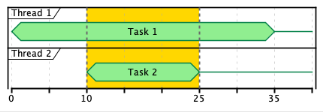
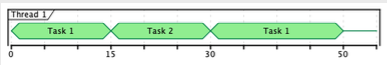

# 第4章. 同時進行の制御

これまでのところ、我々はどちらかといえば不透明な効果を扱ってきた。効果を記述し、最終的にそれを実行して値（あるいはエラー）を生成することはできる。しかし，実行中の計算を制御する方法はまだない．

```scala
val i1: IO[A] = ??? // 1
val i2: IO[B] = ??? // 1
val i3: IO[C] = doSomething(i1, i2) // 1
val c: C = i3.unsafeRunSync() // 2
```

1. これらの効果はまだ始まっていません。私たちは、彼らが計算する内容を説明しただけです。
2. 私たちは、計算が完了したときに、その結果を得ることができます。私たちはその計算方法にアクセスできないので、それに影響を与える（コントロールする）ことはできない。

計算が実行されている可能性があるため、それを制御するということは、その計算と同時進行で行動することになるのです。この章では、同時実行中の効果をフォークして結合する方法、同時実行中の効果をキャンセルする方法、そして複数の効果を同時にレースする方法について説明します。


#### 並行処理と並列処理

よく混同されますが、並行処理と並列処理は別個の概念です。

並行: 計算の実行時間が重なる場合、同時並行となります。
並列: 計算が並列に行われるのは、その実行が同じ瞬間に行われる場合である。

つまり、並行処理が計算の構造や寿命の並び方を見るものであるのに対し、並列処理は実行中のリソースの運用を見るものである。
q
例えば、2つのスレッドを使えば、2つの計算を並列に（同時に！）実行することができます。

しかし、1つのスレッドで2つの計算を同時に実行することもできます。

一方を「一時停止」して、同じスレッドを使ってもう一方に切り替え、その逆も可能であれば、同時実行になります。



2つのスレッドにより、ハイライトされた期間中、計算が並行して実行される。また、同時に実行されている。



計算の中断と再開が可能であれば、1つのスレッドだけで2つの計算を同時に実行することができる。

並行処理では、計算の非決定性を重視します。いつ何が起こるかわからない、ただその寿命が重なっているということです。一方、並列処理には決定性が必要です。リソースがいくつあっても、同じ答えを出さなければなりません。

