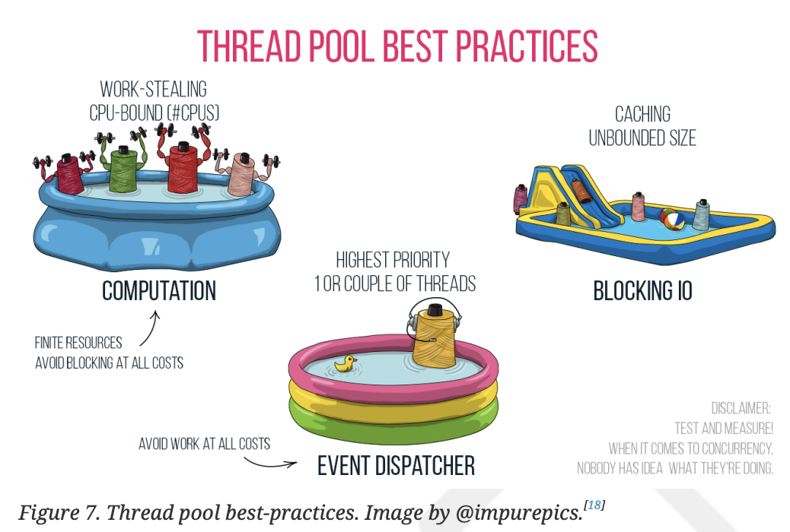
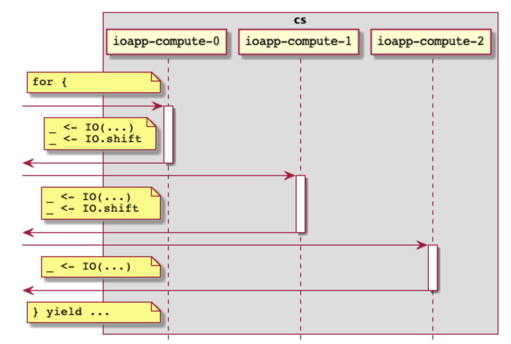
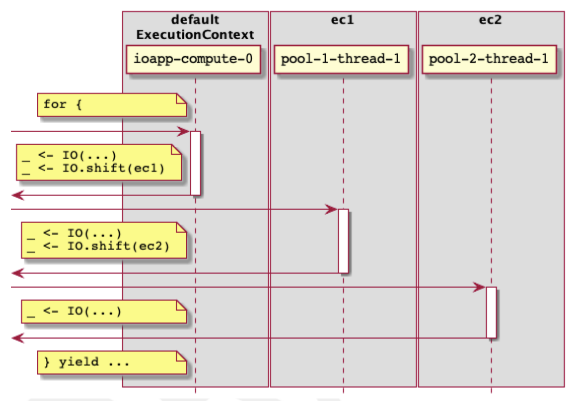

# 第5章. コンテクストの変遷
並列処理は、効果を実行するために一連のリソースを利用する。JVMの場合、これはスレッドプールです。
利用可能なスレッドで同時にエフェクトを実行します。Scalaの主な
スレッドプールを使うためのScalaの主な抽象化は、 scala.concurrent.ExecutionContext である。
Cats Effectはその上に構築され、並列性と同時実行性を実装します。

この章では、これらのコンテキストが IOApp プログラムでどのように使用されるのか、また、作業ブロックとノンブロッキングの違いによって、どのようなことが必要になるのかを探ります。
そして、異なる種類の作業（ブロッキングとノンブロッキング）が、どのように異なる実行戦略を必要とするのかを探ります。

## 5.1. どこまで並列化できるのか？

これまでのところ、並列・並行コードは、IOApp が提供するスレッドなら何でも使ってきました。
これで本当にどれだけの作業ができるのでしょうか？例えば、多くのエフェクトを並列に実行しようとした場合、実際にいくつ並列に実行できるでしょうか？実験してみよう。

```scala
object Parallelism extends IOApp:

  override def run(args: List[String]): IO[ExitCode] =
    for
      _ <- IO(s"number of CPUs: $numCpus").debug
      _ <- tasks.debug
    yield ExitCode.Success

  val numCpus = Runtime.getRuntime().availableProcessors() // 1
  val tasks = List.range(0, numCpus * 2).parTraverse(task) // 2
  def task(i: Int): IO[Int] = IO(i).debug // 3
```

1. この数以上のタスクを確実に投入できるよう、使用可能なCPUの数をお聞きしています。 タスクの数を確保するためです。
2. 多数のタスクを並列に実行したいので、利用可能なCPU数の2倍で試してみよう。
3. 私たちが実行する各エフェクトは、何もしない "No-op "です。

実行すると何が見えるのでしょうか？私のマシンでは、印刷されました。

```shell
[info] [io-compute-6] number of CPUs: 8
[info] [io-compute-2] 0
[info] [io-compute-3] 1
[info] [io-compute-8] 2
[info] [io-compute-5] 3
[info] [io-compute-2] 4
[info] [io-compute-8] 5
[info] [io-compute-8] 6
[info] [io-compute-3] 7
[info] [io-compute-8] 8
[info] [io-compute-2] 9
[info] [io-compute-5] 10
[info] [io-compute-1] 11
[info] [io-compute-4] 12
[info] [io-compute-1] 13
[info] [io-compute-6] 14
[info] [io-compute-5] 15
[info] [io-compute-5] List(0, 1, 2, 3, 4, 5, 6, 7, 8, 9, 10, 11, 12, 13, 14, 15)
```

デバッグ情報を見ると、8つのスレッドを使用していることがわかります。
(io-compute-1)から(io-compute-8)の8つのスレッドを使用していることがデバッグ情報からわかります。
numCpusと同じです。しかし、numCpus以上のタスクがありました。

同時に、CPUの2倍のエフェクト数でparTraverseを走らせました。
どのようにして、すべてのエフェクトを実行させるのでしょうか？

答えは、効果を並列に合成する場合、実行中は各効果の実行がスケジュールされるだけで、別の非同期プロセスが実行されるからです。
実行可能なスレッドでスケジュールされたエフェクトを実行する責任があります。あるスレッドでスレッドが作業を終えると、別のエフェクトがそのスレッドで実行されます。

Scalaでは、これはまさにExecutionContextに対応し、スケジュールされたタスクのキューと、それを実行するスレッドのセットをカプセル化します。
IOAppは、デフォルトのExecutionContextを持っていて、JVM上では、利用可能なCPUの数に基づいて、固定的なプールとして構築されます。
すべてのIOAppベースの例でこの隠されたスレッドプールを使用しています。

## 5.2. 複数のコンテクストの必要性

前の例で、最大でnumCpusの効果しか並列に実行できないことを見ました。これは、numCpus個のCPUしか持っていないので、理にかなっています!
しかし同時に、私たちのコンピュータはnumCpus個以上のことを同時に行うのが普通です。どうすれば
この矛盾した考えをどのように調和させればよいのでしょうか？

JVMでの解決策はスレッドです。多くのスレッドを走らせることができ、その実行はオペレーティングシステムから利用可能なコアに多重化されます。
そして、これらのスレッドを、以下のようなデータ型を使って論理的なグループにプールすることができます。
ExecutionContextのようなデータ型を使って、それらのスレッドを論理的なグループにプールし、あるプール内のスレッドを別のプール内のスレッドから分離することができる。

このような世界では、純粋な価値観でコンピューティングすれば、すべてがうまくいくのです。
値で計算するのであれば、この種の世界ではすべてがうまくいきます。スレッドは競い合って実行され、どんな優先順位や公平性
アルゴリズムが適用され、確実に進歩します。しかし、もし私たちが外部環境と対話し始めると
ファイルからの読み込みやネットワークへの書き込みなど、外部環境とのやり取りを始めると、スレッドがブロックされることがあります。
データはまだ利用できないかもしれないし、ネットワークはまだ何も受け取っていないかもしれない。
受信を確認できないなど、さまざまな理由でブロックされます。前者のような作業を「CPUバウンド」と呼びます。
「CPUバウンド "と呼び、後者のブロッキングを "I/Oバウンド "と呼びます。(I/Oは入出力のことです。

スレッドがブロックされると、JVMはその実行を一時停止し、他のスレッドをオペレーティングシステムが実行できるようにします[16]。
しかし、同時に、可能なスレッドの数に制限がある場合があります。
可能なスレッドの数には制限がある場合があり、通常は基礎となるスレッドプールの構成の一部として
プールを設定する必要があります。プールには最大でn個のスレッドがありますが、それらのスレッドがすべてブロックされている場合、どうすればよいのでしょうか。
ブロックされたらどうしますか？この場合、利用可能なコアを使用してCPU負荷の高い処理を行うことはできません。

I/Oバウンドがブロックされたときに、プログラムが確実に進行するようI/Oバウンド・タスクからCPUバウンド・タスクを分離します。
別々のプールを用意します。Cats Effect ライブラリは、このパターンをサポートするため、以下のことを推奨しています。

- CPUに拘束される作業は、固定サイズのスレッドプールでスケジューリングされます。
  スレッド数は、JVMで利用可能なコア数です。すべてのものが同じであれば
  一度に<CPUの数>以上のことは計算できないので、それ以上のことをしようとしないでください。
- I/Oバウンド作業は、非束縛スレッドプールでスケジューリングされるため、ブロックされたスレッドは、他のタスクの進行を止めることなく、単にメモリを占有するだけです。

JVM上のIOAppでは、デフォルトのExecutionContextはCPUバウンド作業用に設定されています[17]。
次のセクションでは、I/Oバウンド作業にどのようなコンテキストを使用するのか、という質問にお答えします。



## 5.3. I/Oバウンドアクションのためのコンテキスト

独自の ExecutionContext をインスタンス化して、ブロッキング I/O 効果に使用することができます。
それを構成して、未束縛のスレッドプールを使用する。しかし、それはやや困難である他の ExecutionContext 値と同じ型を持っているので、適切に使用するのはやや困難です。
メソッドに間違ったコンテキストを渡すことは簡単にできます。
もし違う型のコンテキストがあればこのような間違いは起こらない。幸いなことに、Cats Effectは正確な解決策を提供してくれます。
Blockerです。

Note: BlockerはCats Effect 2にのみ適用されます。Cats Effect 3でのブロック効果の管理については3 でのブロック効果の管理については後述します。

Cats Effect 3 では、特別な ExecutionContext に支えられた Blocker を使用する代わりに、専用のエフェクトコンストラクタを使用することで、エフェクトのブロック化を早期に宣言することができます。

```scala
object Blocking extends IOApp:

  override def run(args: List[String]): IO[ExitCode] =
    for
      _ <- IO("on default").debug
      _ <- IO.blocking("on blocker").debug // 1
      _ <- IO("where am I?").debug
    yield ExitCode.Success
```

1. IO.blockingで直接ブロッキングを宣言しています。しかし、注意しなければならないのは、ここでのデバッグの呼び出しはデフォルトのコンテキストで実行され、ブロッキングのコンテキストでは実行されないからです。なぜなら、ブロッキング効果は常に前のコンテキストにシフトするからです。

```shell
[info] [io-compute-2] on default
[info] [io-compute-blocker-2] on blocker
[info] [io-compute-blocker-2] where am I?
```

## 5.4. ブロックされていることを知るにはどうしたらよいですか？

Blockerを使ったブロッキング効果を実行するための戦略を別途用意しました。しかし
私たちのしていることがブロッキングなのかどうか、どうすればわかるのでしょう？長年のScala貢献者であり、Cats EffectのメンテナでもあるDaniel Spiewakはヒューリスティックな方法を提供してくれています。[19]

> コールバックAPIがなければ、それはブロック

コールバックAPIは、APIがすぐに結果を返すことができるので、呼び出し元はAPIの計算中にブロックされることはありません。
したがって、そのようなコールバックAPIがない場合、そのメソッドはおそらくブロックされています。

値を返すメソッド
それ自体がコールバックAPIを持つメソッド，例えば scala.concurrent.future や IO などは，そのメソッドがブロックされないことを意味します．

## 5.5. コンテキストのきめ細かな制御

Cats Effectは、エフェクトを実行する際に大まかな（しかし便利な！）区別を推奨しています。
CPUバウンドかI/Oバウンドのどちらかで、プログラマによってそれぞれデフォルトまたはブロックの ExecutionContext に割り当てられます。
しかし、エフェクトとその実行コンテキストの関係に関わるシナリオは、他に2つあります。
それは、長時間実行されるエフェクトと、デフォルトコンテキストとブロッキングコンテキストのいずれでも実行される必要があるエフェクトです。

最初のシナリオでは、長く続く効果である「カチカチ時計」を再確認してみよう。

```scala
val tickingClock: IO[Unit] =
  for {
  _ <- IO(System.currentTimeMillis).debug
  _ <- IO.sleep(1.second)
  _ <- tickingClock
  } yield ()
```

この効果は、1つのスレッドで永遠に実行されるのでしょうか？もしそうだとしたら、それは悪いことです。
なぜなら、tickingClock は実際にはスリープ以外に何もしていないからです。
そのような効果のために現在のスレッドをため込むと、他の効果が実行できるスレッドが1つ少なくなり、私たちの仕事の量が減ります。
アプリケーションの実行量を減らすことになります。

再帰ループがスレッドを盗んで二度と返さないようにするために、私たちは効果そのものとして、「残りの計算をリスケする」と宣言できるようにしたい。
この場合、再開がコンテキストによって実行されたときに、別のスレッドで計算が再開されるだけでなく、他のスケジュールされた効果が前の計算を再利用することができます。
他のスケジュールされた効果が前のスレッドを再利用することができます。言い換えれば、現在のを「中断」して「後方へ」送ることで、他の効果に「飢え」を与えないようにしているのです。
効果がスレッドから「飢え」てしまうことを防ぎます。

Cats Effectでは、この「計算の残りを再スケジュールする」という概念は、より大きな概念である「非同期境界」の一例です。
構成効果の観点からは、境界は、ランタイムが計算を別のスレッドで再開するように再スケジュールできる場所を示す。非同期境界はIO.shiftメソッドで作ることができる．

```scala
object Shifting extends IOApp:

  override def run(args: List[String]): IO[ExitCode] =
    for
      _ <- IO("one").debug
      _ <- IO.cede
      _ <- IO("two").debug
      _ <- IO.cede
      _ <- IO("three").debug
    yield ExitCode.Success
```

シフトするたびに、次のエフェクトが別のスレッドで実行されることがわかります。

カチカチ時計の話に戻りますが、カチカチ時計を実行したとき、複数の非同期境界を追加していないにもかかわらず、複数のスレッドが使用されていることを思い出してください。
IO.shiftで非同期境界を追加していないにもかかわらずです。どうなっているのでしょうか？

私たちの目には見えなくても、私たちの刻む時計と合成された非同期境界が存在するのです。これは IO.sleep 効果によってもたらされたものです。
もし、スリープの間、実際に現在のスレッドをブロックしてしまうと、そのスレッドに非同期が発生してしまいます。
というのも、スリープの間、実際に現在のスレッドをブロックすると、そのスレッドが他の効果によって使用されるのを防ぐことになるからです。



### 5.5.1. 複数のコンテキストを持つシフティング

長時間実行されるエフェクトが、他の同時実行エフェクトに対してより公平になるようにしました。
では、コンテクストでもブロッキングコンテクストでもないところで実行したい場合はどうでしょうか。(例えば、独自のスレッドプールを管理するライブラリと統合する場合などです)
幸いなことに、私たちは指定できるように、非同期境界の概念を拡張することができます。
具体的には、`IO.evalOn`の引数にExecutionContext を取ることができます。

```scala
object ShiftingMultiple extends IOApp:

  override def run(args: List[String]): IO[ExitCode] =
    for
      _ <- IO("one").debug // 1
      _ <- IO("two").debug.evalOn(ec("1")) // 2
      _ <- IO("three").debug.evalOn(ec("2")) // 3
    yield ExitCode.Success


  def ec(name: String): ExecutionContext = // 4
    ExecutionContext.fromExecutor(Executors.newSingleThreadExecutor { r =>
      val t = new Thread(r, s"pool-$name-thread-1")
      t.setDaemon(true) // 5
      t
    })
```

1. デフォルトではIOApp の ExecutionContext 上で実行します。
2. 次のエフェクトのために、別のExecutionContextに移行する。
3. 次に、2つ目のExecutionContextに移行します。
4. 新しいシングルスレッドExecutionContextを作成するためのいくつかの定型文です。
5. JVMが正しくシャットダウンできるように、デーモンスレッドが必要です。これについては第7章「リソースの管理」では、これとは別に取り上げます。

この例を実行すると、出力されます。

```shell
[info] [io-compute-5] one
[info] [pool-1-thread-1] two
[info] [pool-2-thread-1] three
```

プログラム全体では、実行順序は様々なExecutionContextの値に属するスレッド間の間を移動する。



## 5.6. 例: Doobie のデータベースアクセス用コンテキスト

Doobie[20]は、「Scala と Cats のための純粋関数型 JDBC レイヤー」であり、Cats Effect を使用するだけでなく、複数のコンテキストを使用して異なるタイプの処理を行うことを例示しています。
これらのコンテキストは、Transactorデータ型によって使用されます[21]。

> ほとんどのドゥービープログラムは、ConnectionIO[A] 型の値、またはStream[ConnnectionIO, A]型の値で、データベース接続を必要とする計算を記述します。
> JDBC接続を取得する手段を提供することで、これらのプログラムを実際に実行可能な計算に変換することができる。
> この変換を行う最も一般的な方法は、トランザクタを介することです。

トランザクタは、複数のコンテキストを使用して、以下のような制約を適用します。
JDBCを介してデータベースと通信する場合、複数のコンテキストを使用して特定の制約を強制します。

1. データベース接続の取得はブロックされるので、他の種類のエフェクトとは別のスレッドプールを使用する必要があります。しかし、基礎となるJDBCスレッドプール自体が固定されている場合標準的なブロッキングコンテキストを使用する代わりに、別の固定スレッドプールを使用する必要があります。
2. JDBCの操作はそれ自体がブロックされるので、通常のブロックコンテキストを使用する必要があります。
3. ノンブロッキングのクエリ前または後処理は、デフォルトのコンテキストで実行されます。

Doobieがこれらの制約を保証するために、様々な場所で何をしているかを想像することができます。
非同期バリアを挿入して、その状況に適したスレッドプールに効果を移行させます。

## 5.7. まとめ

1. スレッドは、利用可能なプロセッサのセットで同時に実行されるものを抽象化します。 そのため、CPUの数よりも多くのスレッドを持つことができます。scala.concurrent.ExecutionContext はスケジューリングキューを表し，計算のために使われるスレッドの集合も表します．
2. 非同期バウンダリは、長時間実行されるエフェクトが存在する場合、残りのエフェクトを再スケジュールすることで、アプリケーションの進捗を確保するのに役立つ。同時に、さまざまな作業負荷を互いに分離するために、別のコンテクストで再開する計算を指定することができます。
3. IOApp はデフォルトの ExecutionContext を固定数（マシンの CPU 数）で提供します。これは、CPUバウンド（ノンブロッキング）作業用です。
4. I/Oバウンド処理は、通常、CPUバウンド処理よりも遅く、使用するスレッドがブロックされるため、CPUバウンド処理とは別のプールで実行されるべきです。キャッツEffect は、ブロックする Effect を宣言するための Blocker インターフェイスを提供します。

[16] これはひどく簡略化された説明である。[Java言語仕様、第17章：スレッドとロック](https://docs.oracle.com/javase/specs/jls/se8/html/jls-17.html)は、基本的なモデルについて詳しく知ることができる1つの場所です。 Locksは、基礎となるモデルについてもっと学ぶための1つの場所です。
[17] IOApp のデフォルトの ExecutionContext はデーモンスレッドを使用するため、（run メソッドで指定された）トップレベルのエフェクトが完了すると、同時実行中のエフェクトによってアプリケーションが終了することはありません。実行メソッドで指定された）トップレベルの効果が完了した場合、同時に実行中の効果があっても、アプリケーションの終了を妨げないようにするためです。
[18] https://typelevel.org/cats-effect/docs/2.x/concurrency/basics#choosing-thread-pool
[19] https://gitter.im/typelevel/cats-effect?at=5e3b38cd6f9d3d34982283d4
[20] https://tpolecat.github.io/doobie
[21] https://tpolecat.github.io/doobie/docs/14-Managing-Connections.html#about-transactors
