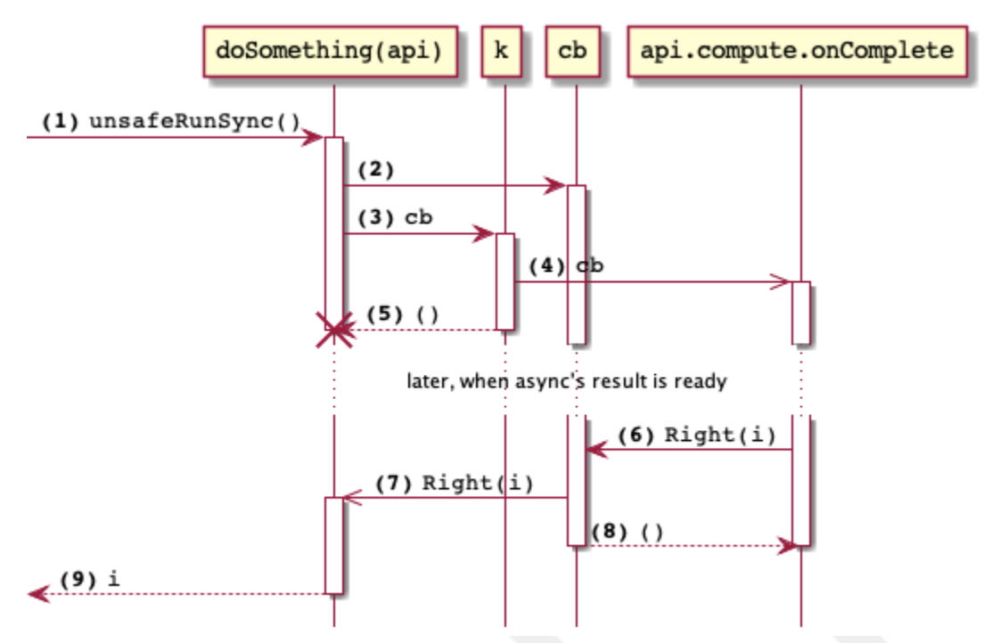

# 第6章. 非同期性の統合

cats.effect.IOのような安全なデータ型を使うプログラムを書きたいとは思っていますが、コードベースは一朝一夕に移行できるものではありません。
私たちはすでに様々な組み込み型と，並列・並行コードを書くための他のライブラリを使っています．
それらをどのようにラップして、IO値を生成することができるでしょうか？

これに答えるために、Cats Effect IO.async メソッドについて説明します。
このメソッドは、継続渡しの一般的なパターンを使って、あらゆる種類の非同期処理インターフェイスを統合します。

## 6.1. 非同期コールバック

> お前が話しかけるな、俺が話しかけるんだ!

どのようにすれば、ありとあらゆる非同期インターフェースと統合できるのでしょうか？そのために、私たちはIO.async メソッドを使用して、コールバックベースの API から IO 値を構築します。
コールバックを提供するAPIは、計算が非同期で行われることを意味することに留意してください。コールバックを提供した後、他の作業を行うことができます。
コールバックは通常、計算が完了すると他のスレッドで実行されます。

```scala
def async[A](k: (Either[Throwable, A] => Unit) => Unit): IO[A]
```

asyncは高階の関数で、この場合、他の関数を引数に取る関数です。
高階関数の例として、より身近なのは
List(1, 2, 3).map(_ + 1)のようなマップです。なぜ、このような手法を使うのでしょうか？私たちは関数を他の関数に渡すのは、その関数を呼び出す必要があるときであって、私たちが呼び出すのではありません：mapは私たちのために
mapはリストの各要素に対して_ + 1という関数を呼び出します。

asyncシグネチャはかなり複雑で、ちょっと読みにくいです。もし、シグネチャの一部に型
のエイリアスを作成すると、少し理解しやすくなります。

```scala
- def async[A](k: (Either[Throwable, A] => Unit) => Unit): IO[A]
+ type Callback[A] = Either[Throwable, A] => Unit // 1
+
+ def async[A](k: CallBack[A] => Unit): IO[A]
```

1. コールバックとは、計算の結果を受け取る関数のことです。この場合、結果はエラー(Throwable)またはタイプAの成功した値のどちらかです。

そのシグネチャを分解すると、asyncに関数kを提供し、asyncはそれを呼び出してコールバックcbを提供します。そして、関数 k 内のコードが cb を呼び出すのは、非同期計算の結果が得られたときです。

IO.async を使って、完全に同期的な計算を指定することも可能です。

```scala
def synchronousSum(l: Int, r: Int): IO[Int] =
  IO.async { cb =>
    cb(Right(l + r)) // 1
  }
```

1. 結果を即座にcbに提供する。処理を開始していない。

しかし、これはかなり人為的な例なので、代わりに実際の非同期効果を作ってみましょう。

### 6.1.1. 非同期実行のトレース

IO.asyncのデモを行うために、何らかのコールバックベースのAPI（この場合はFuture）を使用する新しい非同期IO値を作成してみましょう。
IO.async を使って Future 型に適応させます。

```scala
trait API:
  def compute: Future[Int] = ??? // 1

def doSomething[A](api: API)(using ExecutionContext): IO[Int] =
  IO.async[Int] { cb => // 2
    api.compute.onComplete {
      case Failure(t) => cb(Left(t)) // 3
      case Success(a) => cb(Right(a)) // 3
    }
  }.guarantee(IO.ceda) // 4
```

1. このAPIはFutureを返します。この例では、Futureがどのように生成され、何をするのかは重要ではありません。しかし、返されたFutureはこの時点でスケジュールされていることに注意することが重要です。
2. IO.asyncはコールバックcbを提供し、APIが計算結果を通知できるようにします。
3. APIは結果を計算すると、コールバックにそれを提供する。
4. コールバックはIOでないスレッドで実行されるかもしれないので、次に実行されるエフェクトをにシフトすることで、次に実行される効果が自分たちのスレッドであることを保証する。

IO.asyncで作られたエフェクトを実行するとどうなるかを見ていきましょう。

```scala
val api = new API { ... }
val ds = doSomething(api)
ds.unsafeRunSync()
```

以下の説明では、IO.asyncに与えられたブロックをkと呼ぶことにします。
明示的に書き出すと次のようになります。

```scala
val k: (Either[Throwable,Int] => Unit) => Unit =
  cb => api.compute.onComplete {
  case Failure(t) => cb(Left(t))
  case Success(a) => cb(Right(a))
  }
```



そして、さまざまなピースが呼び出される順番を確認することができるのです。

1. unsafeRunSync を起動し、doSomething(api) で生成した IO[Int] に、Int 型の値の計算を依頼する。
2. IO値は，非同期コードから呼び出される新しいコールバックcbを作成する。cbはEither[Throwable, Int] ⇒ Unitの型を持っています。
3. kを起動し、cbを渡す。
4. kは非同期APIを起動し，api.computeが返すFutureが完了したときにcbが起動されるようにします．
5. 非同期計算を開始したので、kは完了し、Unitを返します。現在のスレッドは、非同期計算によってcbが呼び出されるまでブロックされます。
6. 非同期計算が成功し，Intが計算されてcb(Right(i))を呼び出す．計算が失敗した場合は，例外を含む左関数でcbを呼び出す．
7. cbはunsafeRunSyncスレッドにブロックを解除するよう通知し、Right(i)の値(または失敗した場合は失敗した場合は左(ex)を渡す。）
8. 非同期APIのスレッドで、cbが完了し、Unitを返す。
9. 成功した Int 値を返し、unsafeRunSync の呼び出しを完了します。

ちょっと複雑だけど、目がつぶれるほどではない！？主なアイデアは、cbコールバックを渡すことです。最終的にその結果が渡されます。
待ちのスレッドをブロック解除することができます。

## 6.2. Futureとの融合

scala.concurrent.Future は Scala の非同期計算のための最も一般的なレガシーデータタイプである。
そして、これまで見てきたように、IO.async を使って IO
の値を非同期で実行するFutureとして実装することができます。これは非常に一般的なことなので、Cats
ではビルトインメソッドを用意しています。IO.fromFutureです。

```scala
def asFuture(): Future[String] = // 1
  Future.successful("woo!")
val asIO: IO[String] =
  IO.fromFuture(IO(asFuture)) // 2
```

1. Futureを返すメソッドを統合してみましょう。実際のコードでは、このメソッドは別の場所で定義されたAPIに住んでいます。
2. IO.fromFutureは，IOに包まれたFuture[A]をIO[A]に変換する．

Q. なぜIO.fromFutureはIOの中にFutureを必要とするのですか？

A. Future を作成すると副作用があるため、Future は IO 内に置く必要があります。というのも、Futureを作成すると、Futureが実行されるようにスケジュールされるという副作用があるからです。エフェクトの世界では、 副作用を遅延させる必要があるので、Future の生成はラップする必要があります。

## 6.3. 概要

1. IO.asyncを使うと、(1)非同期処理を開始できる、(2)完了時に1つの結果を返す、またはエラーで終了できる、といった効果を作ることができます。
2. 非同期効果は基本的に継続渡しによって行われます。実際の非同期計算が完了したときに実行されるコードが渡されます。
3. scala.concurrent.Future は，非同期計算の一般的なソースです．IO.fromFutureは，Futureを参照元を持たない効果に変換します．
