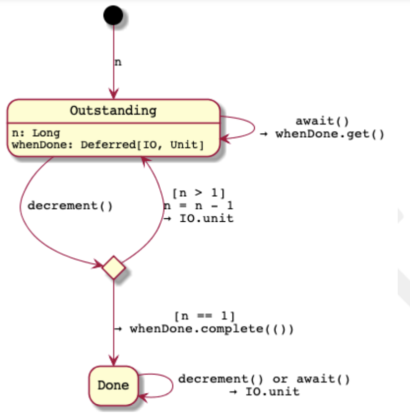

# 第9章 同時進行の調整 コンカレント・コーディネーション

これまで、複数のエフェクトを同時並行で実行するように構成してきました。
最初は、エフェクトが生成する値についてしか話すことができないことを指摘しました。
他のエフェクトの出力を合成することで、新しいエフェクトを作ることができます。
しかし、同時進行する効果間の調整についてはまだ説明していません。

調整とは、あるエフェクトの動作が他のエフェクトに依存することを意味します。
例えば、ある効果間で状態を共有する場合、その状態が同時に更新される可能性があるとき、どのようにすればよいでしょうか？
また、あるエフェクトで作業が完了した後に、別のエフェク トで作業が進むようにするにはどうすればよいでしょうか。

まず最初の課題として、Refデータ型を使ってミュータブルステートを共有することについて説明します。
次に、Deferredデータ型が実際のスレッドをブロックすることなく、どのように同時進行の効果シリアライズを提供する方法を紹介します。最後に、これらの2つの同時並行処理を組み合わせることで、より複雑な動作をモデル化します。

## 9.1. Refによるアトミックアップデート

最初に取り組むべき問題は、「ミュータブル」な状態をどのように安全に共有するかということです。
これを示すために、同時に実行されるエフェクトの間でカウンターを共有することにします。
この場合、一方のエフェクトは、そのエフェクトが実行されるたびにカウンタをインクリメントし、他方のエフェクトは、定期的にカウンタの値を表示します。

エフェクトを作成し、カウンターの状態を共有するためにvarを使用しましょう。

```scala
object ConcurrentStateVar extends IOApp:

  override def run(args: List[String]): IO[ExitCode] =
    for _ <- (tickingClock, printTicks).parTupled // 1
    yield ExitCode.Success

  var ticks: Long = 0L // 2

  val tickingClock: IO[Unit] =
    for
      _ <- IO.sleep(1.second)
      _ <- IO(System.currentTimeMillis).debug
      _ = (ticks = ticks + 1) // 3
      _ <- tickingClock
    yield ()

  val printTicks: IO[Unit] =
      for
        _ <- IO.sleep(5.seconds)
        _ <- IO(s"TICKS: $ticks").debug.void // 4
        _ <- printTicks
      yield ()
```

1. 2つの効果を並行してスタートさせます。
2. 状態を保持するためにvarを使用しています。
3. tickingClockは，1秒ごとに現在時刻を表示し，ここではticksカウンターを更新します。
4. 5秒ごとにprintTicksが起動し，現在のtickカウンターの値を表示します。

このアウトプットを実行する。

```shell
[info] [io-compute-6] 1671364875864
[info] [io-compute-5] 1671364876870
[info] [io-compute-5] 1671364877871
[info] [io-compute-3] 1671364878877
[info] [io-compute-2] TICKS: 4
[info] [io-compute-8] 1671364879880
[info] [io-compute-3] 1671364880885
[info] [io-compute-2] 1671364881887
[info] [io-compute-8] 1671364882888
[info] [io-compute-7] 1671364883893
[info] [io-compute-2] TICKS: 9
[info] [io-compute-8] 1671364884894
```
...といった具合に。約1000ミリ秒ごとに時計が進み、5秒ごとにTICKSが印刷されているのがわかります。

ミュータブルな状態を共有することは「悪いこと」だと教えられてきたのではないでしょうか。どのような問題があるのでしょうか？先ほどの例では、状態を更新できるエフェクトは1つだけでした。
しかし、複数の tickingClock エフェクトが実行されていて、それぞれが同じ var を更新していたらどうでしょう。この場合、常に正しく状態を更新することができるでしょうか？1つの可能性として2つのtickingClockエフェクトが同時に実行されると、このように想像することができます。

```scala
// tickingClock #1
ticks = ticks // 1
// tickingClock #2
ticks = ticks + 1 // 2
+ 1 // 3
```

1. クロック#1は現在のティック値である0を読み取ります。
2. 一方、時計#2は刻みを増やし、現在1になっている。
3. クロック#1は、前回読み込んだ値（0）をインクリメントし、1へ更新します。 1に更新します。クロック#2のインクリメントは記録していないのです!

複数のライターがいる場合、ロストアップデート問題と呼ばれるものが発生する可能性があります。[26]
つまり、状態の更新がアトミックかどうか？varの場合、その答えは「ノー」です。

幸いなことに、これは解決済みの問題です。Cats EffectにはRefがあり、これはJavaデータの型 AtomicReference をラップしています。Refを使えば、状態の更新はアトミックに行われる。

Refを作成するには、Ref[IO].ofファクトリーメソッドを使用し、初期値を渡して格納します。

```scala
val ticks: IO[Ref[IO, Long]] = Ref[IO].of(0L) // 1
```

1. Refを値0で初期化する。

ファクトリーメソッドはRefを効果として返します-これは重要な点です。
このコードを考えてみましょう。

```scala
val doSomething =
  for {
    ref <- ticks  // 1
    // do something with `ref`
  } yield ()
val twice = (doSomething, doSomething).tupled
```

1. 作成されたRefはdoSomethingメソッド内にスコープされます。

doSomethingを2回呼び出すtwiceが、（どういうわけか）同じRefに作用することを期待していたがそんなことはない。doSomethingはRefを作成し、それを使用しますが、そのRefはdoSomethingのスコープ内にしか存在しません。2つの異なるRefのような状態を共有したい場合は、Refを「作成」するエフェクトではなく、実際のRefを共有する必要があります。
の値は、2つのdoSomethingの効果の間に作成されます。というわけで、

```scala
def doSomething(ref: Ref[IO, Long]) = // 1
  for {
  // do something with `ref`
  } yield ()
  
val twice =
  for {
    ref <- ticks // 2
    _   <- (doSomething(ref), doSomething(ref)).tupled
  } yield ()
```

1. 共有状態は、現在のスコープに提供され、その中で作成されることはない。
2. doSomethingの両方の呼び出しを含むようになりました。

この例を更新して、varをRefに変更してみましょう。

```scala
object ConcurrentStateRef extends IOApp:

  override def run(args: List[String]): IO[ExitCode] =
    for
      ticks <- Ref[IO].of(0L) // 1
      _ <- (tickingClock(ticks), printTicks(ticks)).parTupled // 2
    yield ExitCode.Success

  def tickingClock(ticks: Ref[IO, Long]): IO[Unit] =
    for
      _ <- IO.sleep(1.second)
      _ <- IO(System.currentTimeMillis).debug
      _ <- ticks.update(_ + 1) // 3
      _ <- tickingClock(ticks)
    yield ()

  def printTicks(ticks: Ref[IO, Long]): IO[Unit] =
    for
      _ <- IO.sleep(5.seconds)
      n <- ticks.get // 4
      _ <- IO(s"TICKS: $n").debug
      _ <- printTicks(ticks)
    yield ()
```

1. 0で初期化したRefを新規に作成します。生成された値を参照できるようにするために、それをfor-comprehensionに追加します。
2. 並行して稼働する両エフェクトでRefを共有しています。
3. updateメソッドを使って、tick単位でアトミックに状態を更新しています。
4. 現在の状態にはgetメソッドでアクセスする。

重要なのは、今回も Effect パターンに従っていることです。
副作用を、例えば var の更新のように、 Refデータ型によって生成される安全な IO 効果に置き換えています。

### 9.1.1. Refの使用：状態の取得と設定

Refの使い方はいたってシンプルです。現在の状態を取得することができます。

```scala
def get(): IO[A]
```

状態をアトミックに設定する方法はいくつかあります。

```scala
def set(value: A): IO[Unit]
def getAndSet(value: A): IO[A] // 1
```

1. 値をAに設定し、Refの前の値を返す。

また、値の代わりに関数で現在の状態を更新することもできる。

```scala
def update(f: A => A): IO[Unit]
def getAndUpdate(f: A => A): IO[A] // 1
def updateAndGet(f: A => A): IO[A] // 2
```

1. 関数fで値を更新し、前の値を返す
2. 関数 f で値を更新し、新しい値を返す。

また、Modifyを使用すると、状態を更新して、別の型の値を返すことができます。

```scala
def modify[B](f: A => (A, B)): IO[B]
```

update スタイルのメソッドに純粋な (副作用のない) 関数が与えられていることに注意することが重要です。

(以前、更新はアトミックであると言いましたので、更新関数は一度だけ実行されるのでは?)

アトミックアップデートの実装が、この関数を一度しか実行しない可能性があります。
複数の更新が行われていると悲観的に仮定することもできます。
低レベルの相互排他機構を使用して、1つの操作しか実行できないようにすることができます。

その代わり、Refの実際の実装では、同時に1つの更新しか行われないと仮定する楽観的な戦略を採用しています。しかし、もし別の同時更新が成功した場合、こちらの更新操作が再試行されます。

したがって、私たちの関数で副作用を実行したくありません。

複数のライターがアトミックな更新を「勝ち取る」ために競争しているときに、複数回実行されることを示すために、モディファイ内で副作用を実行することを示します。

```scala
object RefUpdateImpure extends IOApp:

  override def run(args: List[String]): IO[ExitCode] =
    for
      ref <- Ref[IO].of(0)
      _ <- List(1, 2, 3).parTraverse(task(_, ref)) // 1
    yield ExitCode.Success

  def task(id: Int, ref: Ref[IO, Int]): IO[Unit] =
    ref
      .modify(previous => id -> println(s"$previous -> $id")) // 2
      .replicateA(3) // 3
      .void
```

1. 同じ Ref を更新する 3 つのタスクを parTraverse で並列に実行します。
2. 戻り値の一部として副作用（println）を実行します。
3. replicateA は効果を n 回繰り返す。

9つのアトミックな更新(3つの要素にそれぞれ3つのモディファイ効果)を期待したのですが
しかし、私たちが修正するために提供した関数への呼び出しは9回以上です。

```shell
[info] 0->1
[info] 0->3
[info] 0->2
[info] 3->2
[info] 2->1
[info] 1->3
[info] 1->2
[info] 3->3
[info] 3->2
[info] 2->2
[info] 3->1
[info] 2->1
[info] 1->1
```

この楽観的な更新戦略は、(少し修正した)モディファイの実装で見ることができます。
この実装では、以下のarの値はJavaのAtomicReference値です。
compareAndSwapメソッドは最初の引数が現在の状態と等しい場合にのみ状態を更新し、その事実を論理値として返します。

```scala
def modify(f: A => (A, B)): IO[B] = {
  @tailrec
  def spin: B = {
    val current = ar.get // 1
    val (updated, b) = f(current) // 2
    if (!ar.compareAndSet(current, updated)) spin // 3
    else b // 4
  }
  IO.delay(spin)
}
```

1. 現在値をコピーする
2. fを用いて、更新値と結果値を計算する。
3. Atomically update ar. 同時更新により現在値がcurrentと同じでなくなった場合はスピンを繰り返す。
4. そうでなければ、Refの値が更新されたので、値bを返す。

与えられた更新に対して一度だけ効果を実行するようにするために、printlnの副作用を IO 値に置き換えます。

```scala
ref
- .modify(previous => id -> println(s"$previous->$id"))
+ .modify(previous => id -> IO(s"$previous->$id").debug)
+ .flatten // 1
```

中からIOを返しているので，modifyの結果を平らにしています．

そして、実行された効果の期待値（9個）を見ることになる。

```shell
[info] [io-compute-4] 1->3
[info] [io-compute-6] 2->1
[info] [io-compute-1] 0->2
[info] [io-compute-4] 3->3
[info] [io-compute-6] 3->1
[info] [io-compute-1] 1->2
[info] [io-compute-6] 2->1
[info] [io-compute-4] 1->3
[info] [io-compute-1] 3->2
```

## 9.2. Deferredを使ったWrite-once同期

ここで、別の問題が発生しました。
カウンタが特定の状態にあることをどうやって知ることができるでしょうか？前の例のカウンタが 13 になったときに "BEEP!と表示することが非常に重要であるとします。

```scala
def beepWhen13(ticks: Ref[IO, Long]): IO[Unit] = // 1
  for {
    t <- ticks.get // 2
    _ <- if (t >= 13) IO("BEEP!").debug // 3
         else IO.sleep(1.seconds) *> beepWhen13(ticks) // 4
  } yield ()
```

1. カウンターの状態を保持するRefを渡します。
2. カウンターの現在値を取得する
3. カウンタが13以上であれば、ビープ音を鳴らして停止します[27]。
4. そうでない場合は、スリープしてから再帰的に処理を再開する

チェックするのに必要な時間を考えるのは良い練習になります。
確かに状態の真の更新頻度に依存します。一方では、あまりに頻繁にポーリングすると非効率的ですし一方、ポーリングの頻度が低すぎると、状態の変化に対する反応が遅くなります。

ポーリング間隔を推測する代わりに、この責任を抽象化することができます。外部からは条件が満たされるまで後続の実行をブロックすることができます。私たちは何もする必要がないのです。私たちは条件のシグナリングをステートに近づけることができます。

Cats Effectでは、この抽象化されたものがDeferredデータ型です。では、これまでのポーリングを使っていた以前の同期を、ブロックするDeferredに置き換えてみましょう。

```scala
object IsThirteen extends IOApp:

  override def run(args: List[String]): IO[ExitCode] =
    for
      ticks <- Ref[IO].of(0L)
      is13 <- Deferred[IO, Unit] // 1
      _ <- (beepWhen13(is13), tickingClock(ticks, is13)).parTupled // 2
    yield ExitCode.Success

  def beepWhen13(is13: Deferred[IO, Unit]) =
    for
      _ <- is13.get // 3
      _ <- IO("BEEP!").debug
    yield ()

  def tickingClock(ticks: Ref[IO, Long], is13: Deferred[IO, Unit]): IO[Unit] =
    for
      _ <- IO.sleep(1.second)
      _ <- IO(System.currentTimeMillis).debug
      count <- ticks.updateAndGet(_ + 1)
      _ <- if (count >= 13) is13.complete(()) else IO.unit // 4
      _ <- tickingClock(ticks, is13)
    yield ()
```

1. 条件を満たしたときにUnit値を保持するDeferredを作成します。
2. 2つの効果は、共有されたis13の値を通じてのみ通信されます
3. getを呼び出すと、is13が値を持つまで現在の効果がブロックされます。
4. tickingClockは、私たちが関心を持つ条件を評価する役割を担っています。もしticksが値13であれば、completeを呼び出してDeferredに値を提供します。待機中のエフェクトのブロックを解除します。

こんな便利なデータ型が、getとcompleteの2つのメソッドだけとは！？

しかし、最後の問題として、実行がDeferred.getの呼び出しからブロックされた場合、そのスレッドはブロックされているのでしょうか？
それは、そのスレッドがブロックされていることを意味するのでしょうか？幸いなことに、私たちにとって答えは「ノー」です。
Cats Effectは、スレッドレベルで実行をブロックするのではなく、いわゆるセマンティックブロッキングを使用しています。
論理レベルではエフェクトは中断されますが、基底となるスレッドは他の同時エフェクトの実行に再利用できます。

#### 同期

同時実行効果がどのように協調するかについて話すとき、状態を共有することなどで同時進行の効果がどのように協調するかについて話すとき、協調に必要な制約についてより正確に話す方法が必要になります。
コンピュータサイエンスでは、同期化という用語が、効果間の関係の強制について話すために使用されます[28]。

serialization: 効果Bは効果Aの後にのみ発生すること。
mutual-exclusion: 効果Aと効果Bは同時に起こってはならない。

それぞれ同期制約の一種である[29]。

IOでの同期はどのように表現するのですか？flatMap(または同等のfor-comprehension)を使うことで、ある効果が別の効果の後に起こるということを表現することができます。

```scala
for {
  a <- effectA
  b <- effectB // 1
} yield a + b
```

1. 効果Bは効果Aの後に確実に発生します。

一方，parMapN を使用すると，各エフェクトの「出力」を変換する以外に何の関係も表さない。

```scala
(effectA, effectB).parMapN((a, b) => a + b)
```

このようなものを使うとき、どの効果が最初に実行されるかは非決定的です。
これは「特徴」です。同期をとる必要はありません。

ファイバーを使うときはどうする？どのような同期の概念があるのでしょうか？ファイバーを開始するとき、独立した効果を表現しています。同時進行の効果を表現しています。結合するとき、後続の効果はすべてファイバーが完了した後に起こらなければなりません。

flatMap や parMapN、Fibers では必ずしも簡単に表現できない、より複雑な効果について考えてみましょう。
flatMap や parMapN、Fibersでは表現しきれない、より複雑な効果を考えてみましょう。
どのような同期が必要なのでしょうか？

共有状態更新: 更新はアトミックでなければならない。つまり、他の更新に対して相互に排他的でなければならない。そうでなければ、更新が「失われる」可能性があります。
読み出し共有状態: 同時読み出しは、同期を必要としない。同期をとる必要はありません。現在の」値が何であれ他の何にも依存せずに読みます。
ブロック: 後続の効果は、「ブロック」された効果が「ブロック解除」された後に発生しなければならない

## 9.3. 同時進行のステートマシン

RefとDeferredは並行処理の構成要素です。Refを使うことで、共有された状態の原子的な更新を保証することができます。共有された状態の原子的な更新を保証し、Deferredは新しく生成された状態に対する効果の実行を直列化する能力を与えてくれます。
また、Deferredは新しく生成された状態に対してエフェクトの実行を直列化する能力を与えてくれます。これらを組み合わせることで
より大きく、より複雑な並行動作を構築することができます。これを行うための1つのテクニックは並行ステートマシンを作成することです。[30]
これを構築するには、次のようにします。

1. メソッドが効果を返すインタフェースを定義しなさい．
2. インターフェイスを実装するには、以下のようなステートマシンを構築します。
   1. 状態 (タイプ S) は Ref[IO, S] 値を介してアトム的に管理される。
   2. 各インターフェース方式は、状態遷移関数によって実装されRefに影響を与えること、および
   3. 状態依存のブロック動作はDeferredの値で制御されます。

例として、このレシピに従ってカウントダウンラッチと呼ばれる構造体を構築します。

### 9.3.1. 例：カウントダウンラッチ

モデル化したい動作は、ある数の（同時に発生する可能性のある）効果が発生するまで、後続の効果をブロックすることです。

ラッチが開くまでドアを閉めておくために使われるからです。カウントダウンという用語は、ラッチがどのように開けられるかのアルゴリズムに言及しています。
カウンタがデクリメントされ、カウンタがゼロになるとラッチ（掛け金）が開く。

共有ラッチを通じて同時に調整される2つの論理的役割があります。
1. 読者はラッチが開くのを待つ
2. ラッチカウンタをデクリメントするライター

ラッチ自体は、カウンタが0になったときに「開く」役割を担っています。

レシピのステップ1（「メソッドが効果を返すインターフェースを定義する」）を満たすために、2つのロールのアクションを共有のメソッドとしてカプセル化しましょう。
2つのロールのアクションを共有のカウントダウンラッチ(CountdownLatch) インターフェースを定義する

```scala
trait CountdownLatch {
  def await: IO[Unit] // 1
  def decrement: IO[Unit] // 2
}
```

1. 読者はラッチの開錠を待ちます。呼び出し側はブロックされ、ラッチが開くまで値は生成されません。
2. ライターはラッチカウンターをデクリメントし，ラッチを開く可能性があります。

読者はラッチが開くのを待ちますが、これはおそらく、一連の前提条件が満たされたことを意味します。

```scala
 def actionWithPrerequisites(latch: CountdownLatch) =
  for {
    _ <- IO("waiting for prerequisites").debug
    _ <- latch.await // 1
    result <- IO("action").debug // 2
  } yield result
```

1. ラッチが開くまでブロックします。
2. ラッチが開いたら、アクションを実行することができます。

同時に、「作家」は、その前提条件を一つ以上満たしていること

```scala
def runPrerequisite(latch: CountdownLatch) =
  for {
    result <- IO("prerequisite").debug
    _ <- latch.decrement // 1
  } yield result
```

1. 前提動作が完了したら、ラッチをデクリメントする

他のコードでは、これらの役割をそれぞれ同時に実行することになります。

```scala
val prepareAndRun =
  for {
    latch <- CountdownLatch(1)
    _ <- (actionWithPrerequisites(latch), runPrerequisite(latch)).parTupled
  } yield ()
```

ここで重要なのは、2つのエフェクトはあくまで共有されたCountdownLatchを通してのみ通信しており、互いについて直接は何も知らないということに注意してください。

実行すると、次のような出力が表示されます。

```shell
[io-compute-1] waiting for prerequisites
[io-compute-2] prerequisite
[io-compute-1] action
```

実装してみよう CountdownLatchは次の2つの状態のどちらかになる。

1. outstanding: 未処理のdecrement()演算がn個あるため、それを期待する。
2. done: decrement() を n 回（またはそれ以上）呼び出した。

レシピのステップ2aの状態を、代数的なデータ型としてエンコードする。

```scala
sealed trait State
case class Outstanding(n: Long, whenDone: Deferred[IO, Unit]) extends State
case class Done() extends State
```

インターフェースの各メソッドについて、ラッチの動作はその現在の状態

読者がawait()を呼び出すと
- 状態がOutstanding(n, whenDone)の場合、未処理のデクリメントコールがn個ある。whenDone.getで呼び出し元をブロックする。
- 状態がDone()であれば、何もしない。

ライターがdeclment()を呼び出すと
- 状態がOutstanding(n, whenDone)である場合
  - n が 1 の場合、これが最後の decrement()となる。Doneに遷移し、whenDone.complete()でブロックされているawait()コールを解除します。
  - それ以外の場合はデクリメントn
- 状態がDone()であれば、何もしない。



図11. n 個のイベント後に開くカウントダウン・ラッチの並列ステートマシン。A
Ref[IO, State]は現在の状態を保持する。

CountdownLatchを構築する際に、状態への同時アクセスをRefで制御し、ブロック動作を制御するためにDeferredを作成します。
状態遷移を、前回説明したのとほぼ同じようにコードに変換します。

* Cats Effect 2

```scala
object CountdownLatch {
  def apply(n: Long)(implicit cs: ContextShift[IO]): IO[CountdownLatch] =
    for {
      whenDone <- Deferred[IO, Unit] // 1
      state <- Ref[IO].of[State](Outstanding(n, whenDone)) // 2
    } yield new CountdownLatch {
      def await: IO[Unit] =
        state.get.flatMap { // 3
          case Outstanding(_, whenDone) => whenDone.get // 4
          case Done() => IO.unit
        }

      def decrement: IO[Unit] =
        state.modify { // 5
          case Outstanding(1, whenDone) =>
            Done() -> whenDone.complete(()) // 6
          case Outstanding(n, whenDone) =>
            Outstanding(n - 1, whenDone) -> IO.unit // 7
          case Done() => Done() -> IO.unit
        }.flatten // 8
    }
}
```

1. await()の呼び出し元をブロックしたりブロック解除したりするために使うDeferred[IO, Unit]を作成します。
2. 現在の状態への原子的アクセスをRef[IO, State]で強制する．
3. await() は決して状態を変更しないので、state.get からの値に対してのみ動作します。
4. デクリメントが未完成の場合は、Deferredが完了したときにブロックを解除するブロッキング効果を返します。
5. decrement() は常に状態を変化させるので、Ref.modify を使用します。
6. これは最後のデクリメントなので、Doneに遷移し、以下のようなエフェクトを返します。
7. カウンターをデクリメントし、何もしないエフェクトを返します。
8. state.modify メソッドは IO[IO[Unit]] を返すので、それを平坦化する。

### 9.3.2. 同期にラッチを使用する

13回目という状態の同期にDeferredを使用することは、小さな欠点があります。
それは条件のロジック（if (count >= 13)式）をtickingClockの効果に押し込んでしまうことです。時計がこの条件を意識しないようにすることはできませんか？
しかし、Deferredのような同期をとるためのブロッキングメソッドを提供することは可能でしょうか？

CountdownLatchでまさにそれを実現することができます。

1. 共有ラッチは希望する刻み数（この場合は13）で初期化されます。
2. ビーパーはラッチを与えられ、ラッチが開くまでブロックされるようにawaitを呼び出します。
3. ティッキングクロックにもラッチが渡され、ティック毎にデクリメントします。

## 9.4. 概要

1. 同時に実行されるエフェクトを調整し、あるエフェクトの動作が他のエフェクトに依存するようにしたい場合があります。その調整の制約条件は、同期化によって記述することができます。
2. 共有されたミュータブルな状態の更新をアトミックに同期させなければ(相互に排他的)でなければ、その状態の変更は、同時実行中に失われる可能性があります。Cats Effectでは、Refは共有された値のアトミックな更新を提供する。
3. また、ある効果が評価されるのは、遅延された値が生成された後であることを保証したい場合があります。Cats Effectでは、Deferredは共有された値のライトワンス、ブロッキング同期を提供します。値が利用可能になる前に、全ての読者はブロックされます。値が書き込まれた時のみ、読者はブロックされなくなります。
4. ブロッキングとは、何らかの（ブロッキング解除）条件が発生するまで、現在の実行が停止することを意味する。セマンティック・ブロッキングは、キャッツ・エフェクトで使用される用語で、現在のエフェクトの「論理的」な実行が、それ以上の実行からブロックされるものです。現在のエフェクトの「論理的」な実行が、それ以上の実行からブロックされる。
5. より複雑な並列動作は、並列ステートマシンを構築することでモデル化することができます。これらはアトミックな更新とブロッキング同期を組み合わせたものです。

[26] 技術的には、この例はトランザクションとは何の関係もありません。この用語が最初に導入された領域の一部である。しかし、状況はほとんど同じです。他の並行性制御の問題については、https://en.wikipedia.org/wiki/Concurrency_control。
[27] カウンターがちょうど13のときだけビープ音を鳴らして停止するのは、タイマーのスケジューリングの問題で、チェックが遅れる可能性があるからです。もし13を見逃し、14まで増加した時、あるいはそれ以降に状態をチェックする場合このメソッドは完了しないでしょう。
[28] 同期に関するほとんどの定義では、効果ではなく「イベント」という用語を使用しているが、ここでは、イベントと効果の完了を同一視している。
[29] The Little Book of Semaphores [[6]](https://greenteapress.com/wp/semaphores)は、協調と同期のパターンについて学ぶのに優れたリソースです。
[30] Fabio Labellaはこの手法を導入し、講演や公開討論を通じて普及させている。解説を通じて普及させた。https://systemfw.org で彼の講演を見たり、より詳しく知ることができる。
